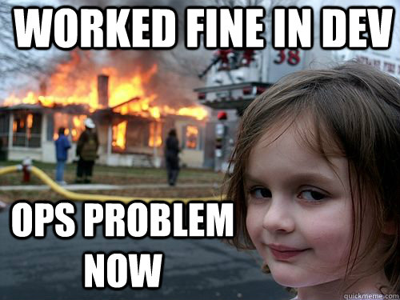

<!-- Content -->
## Content
* DevOps
  * What?
  * Why?
  * You and DevOps...

---
## Conway´s law (1967)
"Organizations which design systems ... are constrained to produce designs which are copies of the communication structures of these organizations."
"the mirroring hypothesis"

---
<!-- DevOps -->
## The problem with delivering software

<!-- {_style="font-size: 140%"} -->
* People
  * Communication, different goals, working in silos
  * Developers creating a feature may have a dependency in other an other team (ops, database administrator etc.)
* Processes
  * Unable to handle changeability, manual workflows, bottlenecks
* Technology
  * Drifting servers, "it worked on my machine", slow delivery, blame game
  * Bugs, delays and so on...
* Web-based companies introduces feature more frequent then those who sell package software

---
<!-- DevOps -->
### The problem with silos

* Developers (Devs)
  * Rewarded for changeability
   * Devs know the code, the internal structure, knowledge about the platform (languages, compilers and so on) and have their own tools
* Operations (Ops)
  * Rewarded for stability and uptime
    * Ops now the underlying system, operating system, hardware, patches, network, logs and so on.
* Customer/Client (+ management, sales, customers, QA, testers...) want both
  * For the client the problem of a service concerns both ops and dev.

--
## Case
Some days after our release the web server(s) experience high load and the service get slow...who to blame!?

<ul><!-- {_class="fragment"} -->
  <li>Developers - The code works on my machine!</li>
  <li>Ops - The server is working - The code is the problem!</li>
</ul>

--
## DevOps is a mindset! 
* Breaking down silos
* Removing bottlenecks
* Creating a a value stream with faster flow for getting ideas to production
  * Pipeline
* Continuous improvement
* Using tools for automated support the above

--
## DevOps is a reaction!
* Web-based companies introduces feature more frequent then those who sell package software
  * Dev - Agile and LEAN Processes
  * Ops - Still waterfall?
  * Web companies/services assume higher availability, more frequent updates
* Devopsday, 2009, Ghent, Belgium <!-- {_class="fragment"} -->
  * "Agile system administrators"
* The need for deep understanding between old silos Dev and Ops <!-- {_class="fragment"} -->
  * Ops using techniques from developers
  * Developers getting greater understanding for operations and deployment - Develop for the production environment
  * Provide both changeability and stability
  * CAMS (https://blog.chef.io/2010/07/16/what-devops-means-to-me)
    * Culture, Automation, Measurement, Sharing
    * Relationships, Integration, Automation Continuous improvement (from the book)

--

## It's about Culture

* Engage early - burst silos!
  * Ops and devs in same team (product specific?)
* Be open
  * Visualize what is happening
* Don´t blame
  * Be constructive, Prepare for failure and learn from failure!
* Communications and involvement in every step

--
## It's about Automation
* If you can script it - script it!
* Consistence and stability using scripts
* Create fast and automated workflows!
  * Never pass defects, smaller batches are better
* Infrastructure as Code (IaC)
  * Bringing dev techniques into system administration
  * Automated testing
* Use tools to help 

--
## It's about Measurement
* Capture and learn!
* Improve feedback, shorten feedback loops, amplify
* Adjust your understanding based on what you learned
* Measure "everything" - Continuous monitoring

--
## It's about sharing
* Treat your processes as applications - build error handling into them
* Share ideas, experience, metrics through the organization
* "Give the Devs root access" - co-ownership
* Learn from metrics
  * Devs have their metrics, Ops have their
* "Intern open source"
  * Innovation days
* Experimentation, allocate time to improve the system/flow

--
## The need to evolve

--
## Examples
* Stand-up meeting, postmortems (all together)
* Game day exercise
* Same development and Operations tool chain
  * Bug-tracking system

---
## So just implementing it...?
* Changing cultures is hard!
  * Do all have the same understanding of DevOps?
  * Just using tools in not enough!
  * "Beer is a good DevOps tool"
* DevOps is not just developers and operations
* Are all projects suitable for "DevOps"?
  * High risk applications?

---
## ...and so on
* DevSecOps/DevOpsSec...
  * "Everyone is responsible for security"
  * Security is a roadblock (waterfall syndrome)
  * Building security into each step of the flow
  * http://www.devsecops.org

---
## Will I work as a DevOps?
* The DevOps Role - Existing?
  * "DevOps Engineer"
  * Site-reliability engineering (SRE)
  * Developer, System administrator, software architect...
    * Through the whole organization
* The mindset influence the courses in UDM

---
## Reading
* In "The practice of cloud system administration"
  * Chapter 8 (three way of devops)
* [The phoenix project](https://www.amazon.com/Phoenix-Project-DevOps-Helping-Business/dp/0988262592)
* [The DevOps handbook](https://www.amazon.com/DevOps-Handbook-World-Class-Reliability-Organizations/dp/1942788002/)
