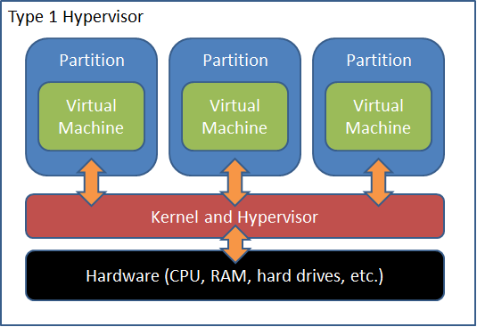

<!-- Start -->
[https://coursepress.lnu.se/kurs/systemadministrationii/](https://coursepress.lnu.se/kurs/systemadministrationii/)

---
### Content

* Virtualization & Virtual Machines
    * What is virtualization
    * What is Virtual Machines?
    * Benefits of Virtual Machines
    * Understanding Virtual Machines
* Containers
    * What is a Container?
    * Virtual Machines vs. Containers
    * Understanding containers

Note:
These are the topics for todays lecture.

---
### Cloud computing and virtualization
* Virtualization enables cloud computing
  * Virtualization seperates OS from hardware
  * Cloud computing seperates application/services from hardware
* Virtualization is a component inside cloud computing

--
### Virtualization

> "the process of changing something that exists in a real form into a virtual version (one that is created using a computer)"

From: https://dictionary.cambridge.org/dictionary/english/virtualization

<!-- {_style="text-align: right; font-size:30%"} -->

---
### Different types of virtualization
* Server virtualization
  * Virtual machines
    * What we focus on in this lecture...
* Application virtualization  <!-- {_class="fragment"} -->
  * Application not installed in traditional sense
  * isolated process or sandboxed
* Memory virtualization  <!-- {_class="fragment"} -->
  *  virtualized memory pool available to any computer in the cluster
* Storage virtualization  <!-- {_class="fragment"} -->
  * treating all storage media (hard disk, optical disk, tape, etc.) in the enterprise as a single pool of storage.
* Network virtualization  <!-- {_class="fragment"} -->
  * combining hardware and software network resources and network functionality into a single, software-based administrative entity, a virtual network.

--
### What is (server) virtualization?

Source: https://www.ibm.com/blogs/cloud-computing/2012/01/12/securing-virtual-machines-in-the-cloud/

<!-- {_style="text-align: right; font-size:30%"} -->

--
## What is Virtual Machines?
> Virtual machines are created when a physical machine is partitioned to run a separate operating system for each partition. 

* Processes running in a VM have no awareness that they are not running on same physical machine <!-- {_class="fragment"} -->
* Can not access the resources, disk, memory, of other VMs on the same physical machine <!-- {_class="fragment"} -->

--
## Benefits of Virtual Machines
*  Consolidation
    * VMs sharing resources, less idle time (stranded capacity)
      * dynamic workload balancing (over allocating)
      * redundancy for server failure
* Isolation into VMs <!-- {_class="fragment"} -->
  * snapshots
* Migration - Move instances between different hardware machines <!-- {_class="fragment"} -->
* Cost Benefit <!-- {_class="fragment"} -->
    * cheaper with on powerful machines (many instances on one server)
    * create virtual versions of legacy systems on modern hardware
* Cons <!-- {_class="fragment"} -->
  * Performance
  * Overhead

Source: [Oracle](https://docs.oracle.com/cd/E27300_01/E27309/html/vmusg-virtualization-reasons.html) 

<!-- {_style="text-align: right; font-size:30%"} -->
Note:
VMs can make computing more efficient. Physical machines today are very fast and powerful, applications don't use all the resources, this excess capacity is usually called **stranded capacity**  
VMs provide better **isolation** than simple multitasking  
Cons: performance and overhead

--
### Understanding Virtual Machines
#### Hypervisor

<!-- {_style="float: right"} -->

* Originally Virtual Machine Monitor (VMM)
  * "Computer software, firmware or hardware that creates and runs virtual machines" 
  * First VMM used for development and debugging of OS
* Properties for ideal VMM<!-- {_class="fragment"} -->
    * Fidelity – identical environment
    * Isolation – complete control
    * Performance – same for VM vs physical
* Host machine, guest machine<!-- {_class="fragment"} -->

--
### Type 1 Hypervisor

<!-- {_style="width: 40%; float: right"} -->

* Runs direct on host's hardware
  * native or bare metal
  * Controlled by management console<!-- {_class="fragment"} -->
    * Hypervisor free
    * features on management console cost
* Examples: <!-- {_class="fragment"} -->
    * Xen
    * MS Hyper-V (?)
    * VMWare ESX

Note:
Less overhead 
Cost

--
### Type 2 Hypervisor

<!-- {_style="width: 40%; float: right"} -->

* Runs on top of an OS 
  * Hosted hypervisor 
  * Less performance then type 1
  * Less reliable then type 1
* Runs as an application <!-- {_class="fragment"} -->
    * VirtualBox
    * VMWare Station
    * Virtual Server
* Allocate resources<!-- {_class="fragment"} -->

Note:
The **first x86** offerings were Type 2, quickest path to market, the host OS already handled all the hardware communication.

--
## Challanges of x86 Virtualization

<!-- {_style="float: right"} -->
* x86-architecture - "The CPU architecture"
  * x86 OS are designed to run on bare-metal
  * Assumes that they fully own H/W
  * Needs to run Privileged Instructions (PI’s) on H/W
* CPU implements four levels/rings of privileges  <!-- {_class="fragment"} -->
  * OS need direct access to H/W (ring 0)
  * User application (ring 3)
* Tricky bit was how to trap these PI’s  <!-- {_class="fragment"} -->
      

Source: [VMware - Understanding Virtualization](https://www.vmware.com/content/dam/digitalmarketing/vmware/en/pdf/techpaper/VMware_paravirtualization.pdf)

<!-- {_style="text-align: right; font-size:70%"} -->

--
### Full virtualization

<!-- {_style="float: right"} -->

* Binary translation of instructions
* Guest OS is not aware and not modified
* OS instructions - translated on fly and cached
* User instructions – run unmodified
      

Source: [VMware - Understanding Virtualization](https://www.vmware.com/content/dam/digitalmarketing/vmware/en/pdf/techpaper/VMware_paravirtualization.pdf)

<!-- {_style="text-align: right; font-size:70%"} -->

--
### Paravirtualization

<!-- {_style="float: right"} -->

* Guest OS kernel is aware and and modified
* Hypervisor is called by guest OS
  * Hypercalls
* also called "OS Assisted Virtualization"
* Enable "near-native performance"
      

Source: [VMware - Understanding Virtualization](https://www.vmware.com/content/dam/digitalmarketing/vmware/en/pdf/techpaper/VMware_paravirtualization.pdf)

<!-- {_style="text-align: right; font-size:70%"} -->

--
### Hardware Assisted Virtualization

<!-- {_style="float: right"} -->

* Needs special H/W (primary host CPUs)
  * to help full virtualization
* Added to x86 - AIntel VT-x , AMD-V
* PI’s automatically trapped and 
     directly executed
* No binary translation 
      

Source: [VMware - Understanding Virtualization](https://www.vmware.com/content/dam/digitalmarketing/vmware/en/pdf/techpaper/VMware_paravirtualization.pdf)

<!-- {_style="text-align: right; font-size:70%"} -->

---
### Containers
> A container is a group of processes running on an operating system that are isolated from other such groups of processes.

 
<!-- {_class="center"} -->
<!-- {_style="width:50%"} -->

 <!-- {_class="fragment"} -->

Source: The Practice of Cloud System Administration

<!-- {_style="text-align: right; font-size:70%"} -->

--
### Containers
* Containers are another virtualization technique
    * Not light-weight VM’s
* Isolation at the process level instead of the machine level <!-- {_class="fragment"} -->
  * Containers share the same host OS kernel
    * "multiple workloads can run on a single OS instance"
    * Light and fast to handle
    * more portable
    * less management overhead

Note:
Black boxex. Dont know whats in them, isolated processes 
Dont care whats in them, know how to distribute them and ship them 
Mitten av 50-talet 
All vet hur man hanterar dem, hor man förvarar dem osv

--
### Virtual Machines vs. Containers

Source: [Docker - What is Docker](https://www.docker.com/what-docker#/VM)

<!-- {_style="text-align: right; font-size:70%"} -->

--
### Virtual Machines vs. Containers
Containers and VMs Together

Source: [Docker for the Virtualization Admin](https://goto.docker.com/docker-virtualization-admin-ebook.html)

<!-- {_style="text-align: right; font-size:70%"} -->

--
### Benefits of Containers
* Ease of Use – build once, run anywhere
* Speed – lightweight, less resources, boot time
* Distribution – make them publicly available
* Modular and Scalable – a container for each service

---
### Next time...

