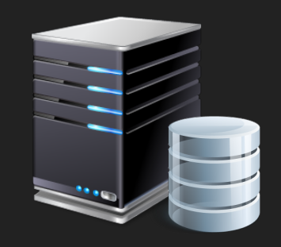
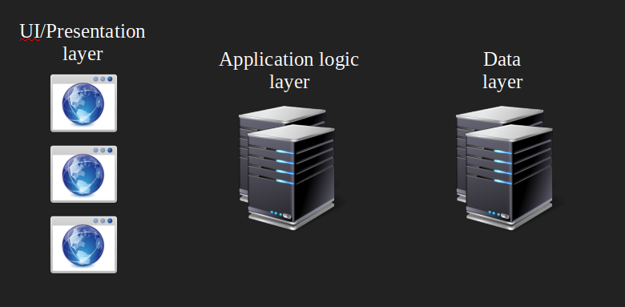
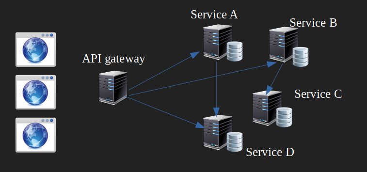

<!-- Start -->
## Today's lecture

* Containers
    * Some history
    * From a software perspective
      * Containers and microservices
* Docker
  * What is Docker
  * Characteristics & basic concepts
* Practical
  * Creating and running docker containers
  * Dockerfile


---
### Containers


<!-- {_class="center"} -->
> Containers are an important technology that is not going away for a while

Note:
separated process<br>


--
### Containers

<!-- {_class="center"} -->
<!-- {_style="width:60%"} -->


Note:
Black boxex. Dont know whats in them, isolated processes<br>
Dont care whats in them, know how to distribute them and ship them<br>
Mitten av 50-talet<br>
All vet hur man hanterar dem, hor man förvarar dem osv


--
### History of process isolating

* UNIX - "jail" - modified runtime preventing application accessing protected resources
  * jails, an early implementation of container technology, was added to FreeBSD, 2000
* 2004, Solaris containers/zones
* 2006-2008, Linux kernel got support for generic process containers, which were later renamed control groups, or cgroups<!-- {_class="fragment"} -->
* 2008 Linux namespaces, processes with own users and root account<!-- {_class="fragment"} -->
* The Linux Containers project, created by engineers from IBM around 2008<!-- {_class="fragment"} -->
  * Projects like **LXC** provided an improved user experience around containers
  * Most complete implementation of Linux container manager.
  * Combine namespace and cgroups


--
### History
* [Docker](https://docker.com) tools to help developers pack their application/code
  * Used LXC in the beginning
  * Now using a own library, *libcontainer*/*opencontainer/runc*
    * Implementation of the Open Container Format Specification (OCF) - 2015
    * [https://www.opencontainers.org/](https://www.opencontainers.org/)
* 2016, CoreOS launches rkt / [Rocket 1.0](https://coreos.com/rkt/)
  * A lightweight Linux operating system designed for clustered deployments
* Orchestrating containers at scale
  * [Kubernetes](https://kubernetes.io/) launched in 2014, Google 
    * Open-source container cluster manager,
  * [Docker swarm](https://docs.docker.com/engine/swarm/)


--
### EVOLVING


<!-- {_style="font-size:75%"} -->


--
## Monolitic architecture


* One monolithic code base
  * Works fine on smaller applications
* Become hard to work with when code base growing<!-- {_class="fragment"} -->
  * Hard to change...
* Hard to scale<!-- {_class="fragment"} -->


--
## n-tier architecture


* Some isolation and separation of concerns
  * More easy to change code in one layer without messing with the others
* Better scalability<!-- {_class="fragment"} -->


--
## Microservice architecture



* Isolate different part of a more complex application into services
  * Communicates with HTTP-APIs (REST APIs)
  * Could use different technologies in different services
  * https://microservices.io/
* Better and more flexible scalability<!-- {_class="fragment"} -->
* Containers very suitable!<!-- {_class="fragment"} -->


---

<div>
<!-- {_class="center"} -->
</div>
<!-- {_style="width:75%"} -->


--
### What is Docker?
* Docker provides a platform and tooling to manage containers
  * At the beginning from developers point of view
* Started in France as an internal project within dotCloud (now Docker inc.), a platform-as-a-service company <!-- {_class="fragment"} -->
* Focus on minimize the gap from development to deployment <!-- {_class="fragment"} -->
  * Developing, shipping and running - easy and portable
  * Minimize the diversion between development- and production environment
    * "It works on my machine"-syndrome
* The Docker platform is "Open Source", Promoted by the Docker, Inc <!-- {_class="fragment"} -->
  * https://www.docker.com/community/open-source
  * [Open Container Initiative (OCI)](https://www.opencontainers.org/)


--
### Docker Engine

* Docker Engine
  * A client-server application
    * Server, docker deamon (dockerd), creates and manage Docker objects (images, containers, networks and volumes)
    * REST API, HTTP interface for programs to talk to the deamon
    * A CLI client
      * Could be other tools...communicating with the API


<!-- {_class="center"} -->

https://docs.docker.com/engine/docker-overview/#docker-engine
<!-- {_style="text-align: right; font-size:60%"} -->


--
### Docker objects
* Images
  * read-only templates with instructions for creating a container
    * Often an image is based on another image with extra "instructions"
    * Defined in a *Dockerfile*
    * Push to and pull from a *registry*
* Containers <!-- {_class="fragment"} -->
  * A runnable instance of an image
  * Well isolated from other containers and its host machines
  * ``` docker run -i -t ubuntu /bin/bash ```
    * Using the "ubuntu" image - connects to /bin/bash
* We build images, we run containers... <!-- {_class="fragment"} -->


--
### Docker Registry

* Stores *docker images*
* Public (https://hub.docker.com/) or Private (own server) 
* Docker store - Buy and sell application or services <!-- {_class="fragment"} -->


<!-- {_style="width:50%"} -->


--
### Docker characteristics

* Layers - Changes are done in layers, not the whole image
  * Uses a union filesystem (overlay, auFS)
  * A change to an original image is put in a new layer, not recreate the whole image
    * be re-used by multiple images saving disk space and reducing time to build 
    * https://medium.com/@jessgreb01/digging-into-docker-layers-c22f948ed612
* One images - A single process --> Best practice  <!-- {_class="fragment"} -->
  * Application-centric
  * Application server, load balancer, reversed proxy, database server...
* Portable  <!-- {_class="fragment"} -->
  * The application is separated from low level configurations.
  * Easy to move and run on other Docker engines  
    * Think of containers on a ship...
* Stateless, read-only, "Immutable"  <!-- {_class="fragment"} -->
  * Using the image guarantee same containers in all environments


--
###  Volumes
* How to handle dynamic data in a read-only container?
* Docker is using Volumes - Containers for storing persistent data  <!-- {_class="fragment"} -->
* Using a volume does not increase the size of containers using it  <!-- {_class="fragment"} -->
* A volume could be used/mounted by many containers  <!-- {_class="fragment"} -->
  * By default, not deleted when container is stopped
  * Recreate a server, still need the data


https://docs.docker.com/engine/admin/volumes/volumes/<!-- {_class="fragment"} -->

<!-- {_style="text-align: right; font-size:60%"} -->


---
### Getting started

* Community Edition (CE) and Enterprise Edition (EE)
  * https://docs.docker.com/engine/installation/
    * Docker for mac, Docker for Windows
    * Requires Microsoft Windows 10 Professional or Enterprise 64-bit.
  * Read installations instructions for your linux dist.
    * https://docs.docker.com/engine/installation/linux/docker-ce/ubuntu/


<!-- {_style="width:50%"} -->

Source: [docker.com](https://docker.com)

<!-- {_style="text-align: right; font-size:60%"} -->


--
### Is it working?

```bash
docker run hello-world
```


--
### Basic ubuntu container

```bash
docker run -i -t ubuntu /bin/bash
```

Note: 'cat /etc/*release*


---
### The Dockerfile
* In the Dockerfile (a textfile) you define your image from which you build your container(s)
* Contains all the commands needed for the preferred image
* Load and build with ``` docker build .```


--

```
FROM ubuntu:18.04
LABEL "com.example.vendor"="LNU"
LABEL version="1.0"
LABEL description="This is just a demo"
LABEL maintainer="thajo@lnu.se"

RUN apt-get update \
    && apt-get install -y nginx \
    && apt-get clean \
    && rm -rf /var/lib/apt/lists/* /tmp/* /var/tmp/* 

EXPOSE 80
CMD ["nginx", "-g", "daemon off;"]

```

```
docker build . -t thajo/nginx
docker run -p 8080:80 -d thajo/nginx
```

Note:
Each command in a own layer<br>
#Running the build
docker build . -t thajo/rails
# Starting a container
docker run -p 80:80 -d thajo/rails
#stoping
docker stop id


--
### Dockerfile commands

* FROM
  * Defines the base image to work with
* LABEL
  * Meta data about this image (creator, maintainer and so on)
* RUN
  * Specifies one (or combined) commands to run in the shell
* CMD
  * One per file, defaults for an executing container (entrypoint is default /bin/sh)
* COPY
  * Copy files or directory and add them to the containers file system
* ADD
  * Like copy, could use URLs, could unpack some compressed files


--
### Dockerfile commands
* ENV
  * Sets an environment variable in the container
* WORKDIR
  * Specifies the working directory from where RUN, CMD, COPY, ADD...runs
* EXPOSE
  * Exposes the ports to the container
* VOLUME
  * Instructs how to create a mount point for holding data


https://docs.docker.com/engine/reference/builder/


--
```bash
## Example
FROM node:alpine
LABEL maintainer="thajo@lnu.se"
# Expose a port from the container
EXPOSE 8080
# Set an env-variable
ENV INSTALL_PATH /var/www/app
RUN mkdir -p  $INSTALL_PATH
WORKDIR  $INSTALL_PATH
# Copy code
COPY package.json .
RUN npm install --quiet
# Copy app
COPY . .
CMD ["npm", "start"]
```


--
## Commands to test

```bash
# Running the build with a tag
docker build . -t thajo/node
# Starting a container
docker run -p 8080:8080 -d thajo/node
# Starting a container with a bash
docker run -t -i  thajo/node /bin/bash
# Stop all containers
docker stop $(docker ps -a -q)
# Remove all containers
docker rm $(docker ps -a -q)
# Remove all images
docker rmi $(docker images -q)
# Remove all volumes (make sure to remove the volume container first)
docker volume rm $(docker volume ls -qf dangling=true)
```


--
```bash
## Creates a volume with the name "logs"
docker volume create --name logs
## start a container and mounts the volume
docker run -d -v logs:/var/logs/nginx nginx
## use the same volume (maybe for reading)
docker run -t -i -v logs centos /bin/bash

## Delete most of the things...
docker system prune -a
```


--
## Get started

https://docs.docker.com/get-started/
