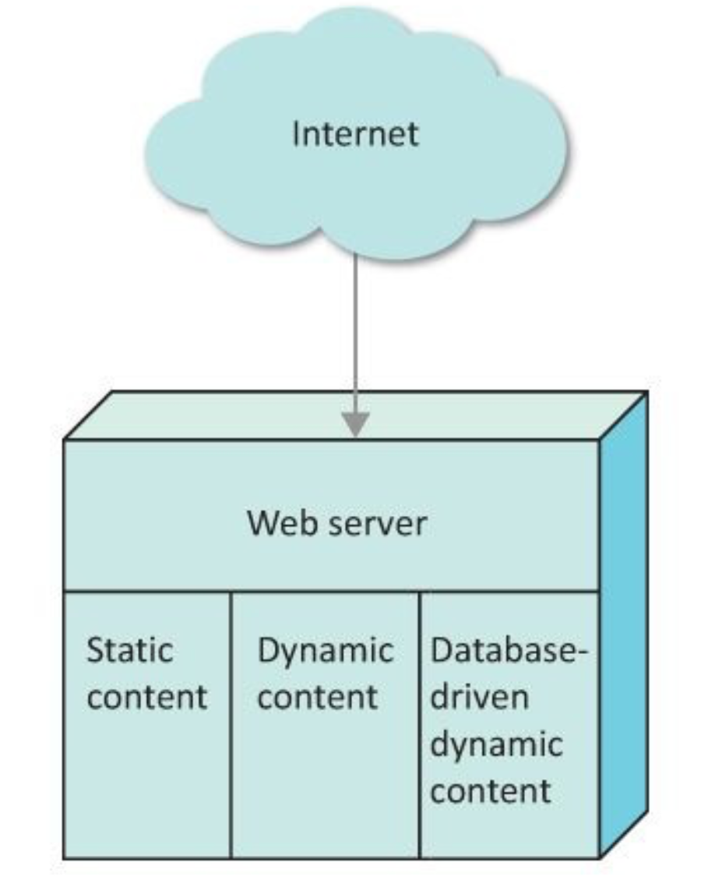
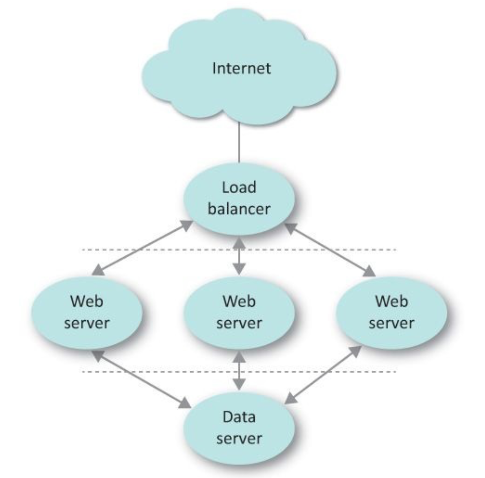
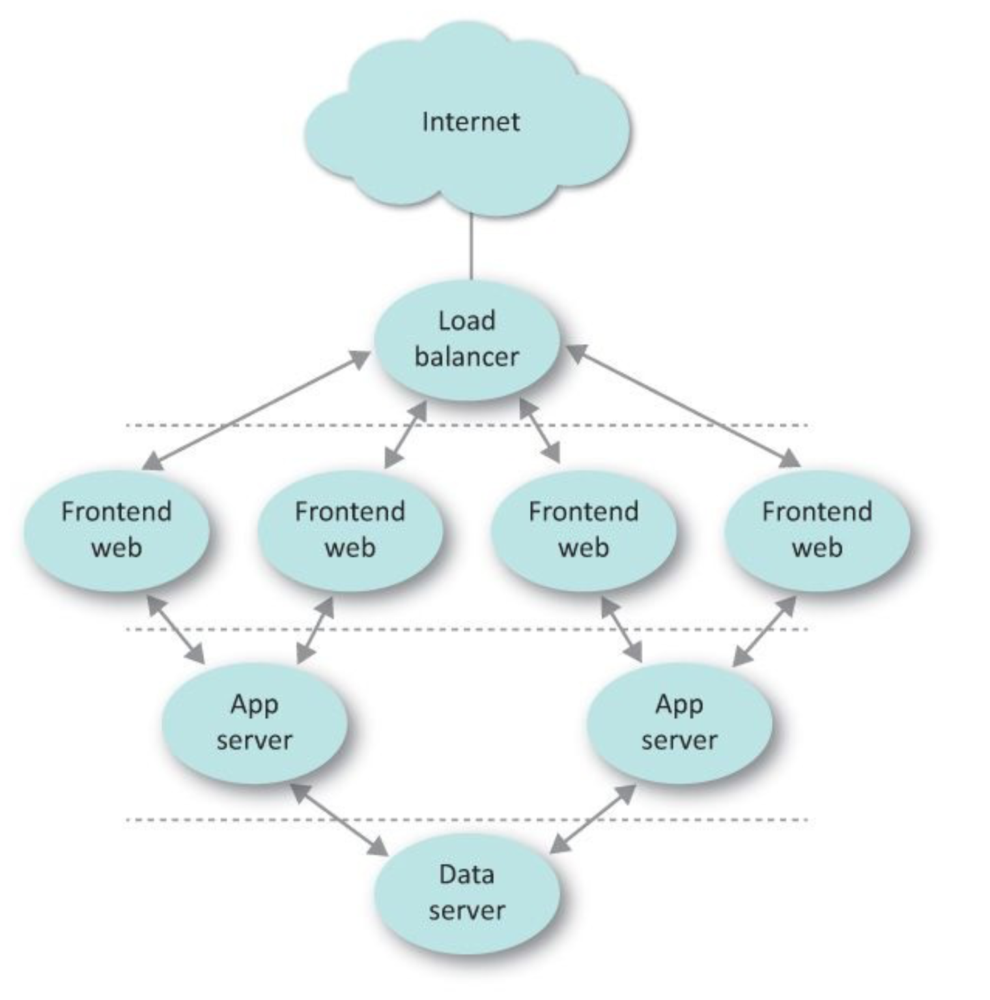
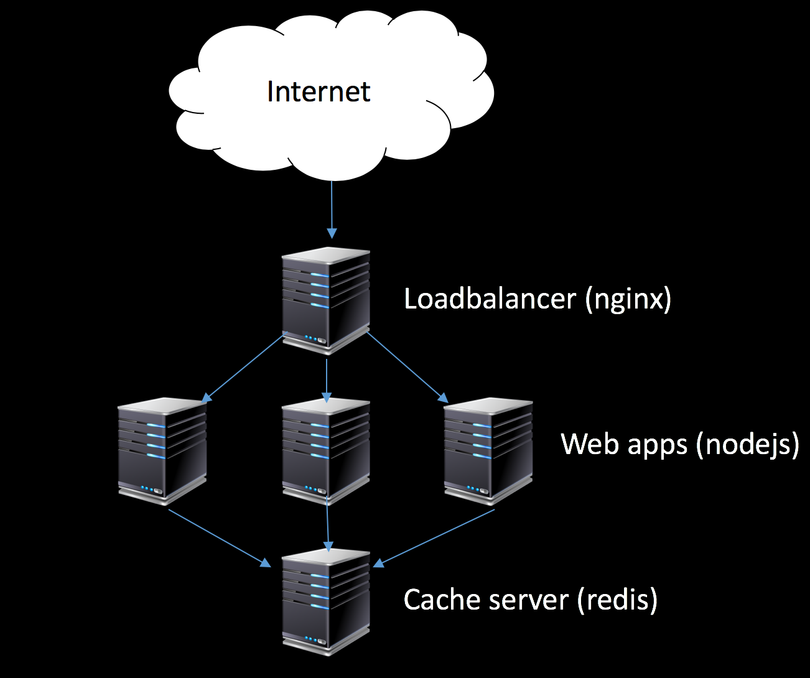
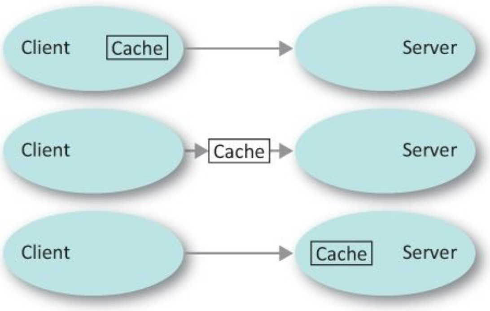

<!-- Start -->
### Today's lecture
* Applications architecture
  * Web-based viewpoint
* Scaling patterns
  * load balancers
  * cache

Book - The practice of cloud system administrations<br>
Chapter 4-5


---
### Single-machine Web Server

* Web app, database, static/dynamic content on same server
  * Monolithic code base
* Good for smaller applications
* Problems with
  * many simultaneous user, maintenance
  * optimizing server for a specific service (like web, db)
    * buffer thrashing - different algorithms for disk I/O performance
* Scale by adding more memory, more disk, more CPU (to some point)
  * Vertical scaling


<!-- {_style="width:12%"} -->


--
### Three-tier Web Service
* Design in layers
  * Load balancer layer
    * be able to distribute incoming requests over a number of backend servers according to a scheduling algorithm.
  * Web server layer (application layer)
  * Data service layer  
* Scale by adding more instances
  * Horizontal scaling


<!-- {_style="width:18%"} -->


--
### Four-tier Web Service
* Adding a front-end layer
  * The front-end servers and applications servers run on different machines
  * Decouples responsibility from the application 
    * Protocol, Encryption, compression, session handling
    * Minimizing attack vectors
  * Front-end handles stuff common to all applications in a service
  * Optimize for high network through-put, minimize storage
  * Reverse proxy service
* Application servers and data layer servers optimizes


<!-- {_style="width:16%"} -->


--
### Examples of load balancers
* Hardware-based
  * Expensive, full control
* Cloud-based
  * AWS Elastic load balancer
  * Azure Load Balancer
  * ...
* Software-based
  * Nginx / Nginx plus
  * HAProxy
  * Traefik
  * Seesaw
  * ...

https://geekflare.com/open-source-load-balancer/


--
### Load balancers
* Layer 3 and 4 Load balancers
  * Layer 3 - IP, Layer 4 TCP/UDP
  * L3 load balancers track sessions by using destination and source IP 
    * All traffic from a computer guarantees that the same replica server gets the request
  * L4 load balancers also adds port information
  * Simple and fast
* Layer 7 Load balancers
  * Analyze the application layer
  * Look inside HTTP packets (cookies, header...)
  * require more resources, more control


--
### Load balancing methods
* Round robin (RR)
  * Rotated in a loop
* Weighted RR
  * Like RR but some backend servers could get more requests
* Least Loaded (LL) / Least Connection (LC)
  * Load balancer get information from backend and choose the one that is best suited
* Least loaded - slow start
  * What happens when a new backend appears?
    * Start at low rate 
* Latency
  * load balancer investigate the response time for each backend server
* Cascade
  * Fill the first backend server, then next and so on
    * Must know exactly how much traffic each server can handle


--
### Small demo


<!-- {_style="width:60%"} -->


--
### High-availability (HA)
* Single point of failure (SPOF)?


<!-- {_style="width:70%"} -->

https://www.digitalocean.com/community/tutorials/what-is-high-availability
<!-- {_style="font-size:40%"} -->


--
### How to handle the state?
* Log in on replica 3, next request goes to replica 1
* Sticky connections
  * Could analyze HTTP traffic, send next request to same server
  * What if that backend server dies?
* Shared state
  * Store session where all backends could access it
* Hybrid
  * Use sticky connection for fastest and shared states to avoid errors


---
### Scaling

* Handling ability to process growing workload
  * Build for success, for growing
  * Slow services is more annoying then services that are temporary down?
* Premature optimization
  * Spend time on scaling issues that we may not need?
  * We maybe don´t need to scale but our system should be able to
* Be proactive
  * Not to early, not to late...


--
### Scaling strategy
* Identify bottlenecks
  * A point in the system where performance is important
* Reengineering components
* Refactor code
* Measuring results
  * Monitoring, metrics, load testing


--
### Scaling terms
* Scaling up
  * Scaling vertical
  * Adding more resources to the server
    * CPU, RAM, Network...
    * Expensive, will we get enough power?
    * Will throughput be better? CPU locks
* Scaling out/in
  * Scaling horizontal
  * Adding/removing replicas


--
### Scaling cube (AKF)

<!-- {_style="width:60%"} -->


--
### Scaling cube (AKF)

<!-- {_style="width:10%"} -->
* x-axis is horizontal duplication
  * clone replicas, scaling out
    * Could be problem when handling transaction data
* y-axis
  * Functional or service split
    * Going from monolith to n-tier to microservice
    * Split requests, Quality of Service (QoS)
* z-axis - Lookup-oriented split
  * Splitting databases by year
    * Some year are more popular to read (use x-axis technique)
    * Many dbs could be read-only
  * Segment data by geolocation


---
### Caching

* Make performance boost by placing data on faster (and more expensive) media
* Place data closer to user
* Caching in every layer
  * Hardware, CPU, L1-cache RAM, OS
  * In application
    * Put frequently used data in RAM instead of reading from database
  * Through the network
    * HTTP caching, CDN, Web Proxies
  * Browser caching


<!-- {_style="width:25%"} -->


--
### Terms

* Cache miss
  * The requested data is not available in the cache 
* Cache hit
  * The requested data in fetch from cache
* Cache hit ratio/rate
  * nr of cache hits / total requests
* Stale cache
  * Cache that is not fresh
* Cold system
  * When the system starts the cache is empty
* Warmed system
  * Run queries to warm up the system


--
### Cache effectiveness

* H = Time when making a cache hit (1s)
* M = Time when making a cache miss (3.1s)
* R = Cache ratio (40%)
* L = regular lookup (3s)

```
H x R + M x ( 1 - R ) < L 

1 x 0.4 + 3.1 x (1 - 0.4) < 3

2.1 < 3
```


--
### Cache replacement

* What happens when the cache is full?
  * Which data to release?
* LRU - Least recently used
  * Good when many request in short time period
    * Like DNS
* LFU - Least frequently used
  * Counts the number of times a cache entry is accessed
    * Total, daily, hourly...
    * Good when some data are trending...
* many different that are improved combinations of these two


--
### What if cache gets old and invalidated?
* Changes has been made to source data not to cache
  * The cache is stale.
* Invalidate the cache when updating source
  * Easy but keeps cache cold
* Data source communicate to cache when an entry is updated
  * Could be hard to implement
* Use timestamp (TTL)
  * The cache is only fresh for some time
  * Just a few seconds could do a lot to performance!
* Cache layer could poll the data source to see it is fresh


---
### Some small demo

<!-- {_style="width:60%"} -->

---
-
## Capacity planning
* Chapter 18 (p. 365-378)
* Ensuring enough resources when needed
  * no over- or under capacity
* Avoid services failing, improving cost effectiveness
* Data-driven process
  * Automated collected data from monitoring tools
  * Could be analyzed (advanced) mathematical models


--
* Primary resource
  * Which resource is most critical for a service? CPU? Storage?
    * First step to identify
* Secondary resource
  * Not interesting when calculating capacity but should be monitored 
* Ancillary (sv: underordnad) resource
  * server instances, load balancers, power, other infrastructure components
    * Find the relationship between primary resources and ancillary resources
* Core driver
  * Factors that strongly drive demand for the primary resource
  * QPS
    * Query per seconds
  * MAU
    * Monthly active users
* Time series
  * Sequence of data points measured at time intervals


--
### Standard capacity planning
What are you going to need? When? Yearly calculation for each resource

```
Future resources = 
Current resources x (1 + normal growth + planned growth) + headroom
Additional resources = future resources - current resources
```

* Normal growth (%)
  * Without business or marketing events
  * Calculated by observing historic data (more the better)
* Planned growth (%)
  * Events, campaign, product launch  
* Headroom
  * Short-time spikes (percentage of current capacity)
  * Should be notified by monitoring 


--
#### Capacity model

* Capacity model shows the relationship between core driver and primary resource
  * Try to show how changes in core drivers will affect primary resources
  * Which core driver influence which resource and how strongly - By correlation 1 to -1
  * Regression analysis (sv. Regressionsanalys) on time-series data
* Changes in service will probably change the correlation, needs to be recalculated
* Could be used for forecasting models


<!-- {_class="center"} -->


--
### Formula


<!-- {_class="center"} -->


--
## Next time...


<!-- {_class="center"} -->
