<!-- Start -->
# Today's lecture <!-- {_style="font-size:140%"} -->
* Recap of 1DV031
  * OS Installation and Post Setup
    * Server OS Installation
    * Managing your Server
    * Post Setup
  * Some Server services
    * DNS
    * DHCP
    * HTTP - Web server
  * Directory Service
  * Security
    * Cryptography - Basic Principles
    * Permissions

Note:
These are the topics for todays lecture.


---
## OS Installation - Pre Installation
### Things to consider
* Operating System
* Hardware
* Location

### Factors<!-- {_class="fragment" data-fragment-index="1"} -->
* Server purpose
* Compatibility
* Cost
* Knowledge

<!-- {_class="fragment" data-fragment-index="1"} -->

Note:
OS
Hardware - HCL


--
## OS Installation - Pre Installation
### How to choose an server OS
|  | Windows | Linux |
|--|---------|-------|
| Hardware requirements | High<!-- {_class="fragment" data-fragment-index="1"} --> | Low<!-- {_class="fragment" data-fragment-index="1"} --> |
| Getting Started | Easy<!-- {_class="fragment" data-fragment-index="2"} --> | Hard<!-- {_class="fragment" data-fragment-index="2"} --> |
| Stability | Medium<!-- {_class="fragment" data-fragment-index="3"} --> | High<!-- {_class="fragment" data-fragment-index="3"} --> |
| Functionality | High<!-- {_class="fragment" data-fragment-index="4"} --> | Low<!-- {_class="fragment" data-fragment-index="4"} --> |
| Security | High<!-- {_class="fragment" data-fragment-index="5"} --> | High<!-- {_class="fragment" data-fragment-index="5"} --> |
| Support | Include<!-- {_class="fragment" data-fragment-index="6"} --> | Costs<!-- {_class="fragment" data-fragment-index="6"} --> |
| TCO | $$$<!-- {_class="fragment" data-fragment-index="7"} --> | $$<!-- {_class="fragment" data-fragment-index="7"} --> |

<!-- {_style="font-size: 90%; margin: 0px"} -->


--
## Managing your Server
### Windows vs. Linux
* Linux comes in many flavors - Distributions
* GUI
  * Linux: Gnome, Unity, Cinnamon, MATE, KDE, Xfce, LXDE
* Shell, text Mode Interface or CLI
  * Windows: Command prompt (cmd.exe), Windows PowerShell
  * Linux: Bash, Korn shell, Bourne shell, ash, C shell
* Managing the server and services
  * Windows: MMC, PowerShell
  * Linux: depends on the task, usually a CLI

Note:
http://www.michaelhorowitz.com/Linux.vs.Windows.html
A shell is a command interpreter. Commands can be executable files or built-ins. Commands can be bundled together into a script which a shell program executes. How the commands are packaged and wired together, using variables, functions, and control-flow operators makes up the shell's scripting language.


--
## Managing your Server
### GUI or CLI
|   | CLI | GUI |
| - | --- | --- |
| Ease of use | ✘<!-- {_class="fragment" data-fragment-index="2"} -->|  ✔<!-- {_class="fragment" data-fragment-index="2"} -->|
| Speed | ✔<!-- {_class="fragment" data-fragment-index="3"} -->|  ✘<!-- {_class="fragment" data-fragment-index="3"} -->|
| Multitasking | ✘<!-- {_class="fragment" data-fragment-index="4"} -->|  ✔<!-- {_class="fragment" data-fragment-index="4"} -->|
| Scripting | ✔<!-- {_class="fragment" data-fragment-index="5"} -->|  ✘<!-- {_class="fragment" data-fragment-index="5"} -->|
| Remote access | ✔<!-- {_class="fragment" data-fragment-index="6"} -->|  ✘<!-- {_class="fragment" data-fragment-index="6"} -->|
| History | ✔<!-- {_class="fragment" data-fragment-index="7"} -->|  ✘<!-- {_class="fragment" data-fragment-index="7"} -->|
| Resources | ✔<!-- {_class="fragment" data-fragment-index="8"} -->|  ✘<!-- {_class="fragment" data-fragment-index="8"} -->|
||||
<!-- {_class="fragment" data-fragment-index="1" style="font-size: 90%; margin: 0px"} -->


--
## Managing your Linux Server - Bash
Built-in commands
```
:         command    eval      jobs      read        times
.         compgen    exec      kill      readarray   trap
[         complete   exit      let       readonly    type
alias     compopt    export    local     return      typeset
bg        continue   fc        logout    set         ulimit
bind      declare    fg        mapfile   shift       umask
break     dirs       getopts   pushd     shopt       unalias
builtin   disown     hash      popd      source      unset
caller    echo       help      pwd       suspend     wait
cd        enable     history   printf    test
```
<!-- {_style="margin-right: 35%; width: 65%;"} -->
> Remember a command is either an executable file or is built into the shell.


--
## Managing your Linux Server - Bash
### Using the commandline like a pro

| Shortcuts | Output |
| --------- | ------ |
| Ctrl+A | Cursor to beginning of line |
| Ctrl+E | Cursor end of line |
| Ctrl+K | Delete to end of line |
| Ctrl+_ | Undo |
| Up and down arrows | Previous/next command in history |
| Left and right arrows | Previous/next character on current line |
| Tab | Autocompletion |
| Ctrl+R | Search the history |
| Ctrl+L | Clear the screen |
| !! | Repeat last command |
| !___ | Repeat last command beginning with ___ |
| Ctrl+C | Interrupt currently running process |
<!-- {_style="font-size: 58%; margin: 0px"} -->


--
### Managing your Windows Server - PowerShell
* Windows PowerShell is… <!-- {_class="fragment"} -->
  * …a command prompt.
  * …a scripting language.
  * … a combination of several components (cmdlets, pronounced command-lets) between the objects (not text!) can be sent ("Piped").
* You have… <!-- {_class="fragment"} -->
  * …full access to the Microsoft .NET Framework.
  * …an environment where you can perform administrative tasks by executing cmdlets.
  * …an environment where you can execute scripts that contain cmdlets and the code that processes the data of various kinds.
* You can… <!-- {_class="fragment"} -->
  * …for example. work with objects, variables, files, directories, registry, AD and databases.

<!-- {_style="width: 70%"} -->


--
## Post Setup
* Install drivers, Chip-set
* Computer name
* Configure network
* Updates
* Security
* Documentation


---
## DHCP
Dynamic Host Configuration Protocol
* Bootstrap Protocol (BOOTP)
* Centralized management of IP addresses
* Can help with IP address conflicts


<!-- {_style="width: 60%"} -->


--
## DHCP – Terminology
* Scope
* Exclusion range
* Address pool
* Lease
* Reservation

<!-- {_style="font-size: 100%"} -->

Note:
DHCP-terminologi:
Scope: Det IP-adressområde som DHCP-serven tilldelar IP-adresser ifrån
Exclusion range: IP-adresser i scopet som inte delas ut
Address pool: Lagrar de IP-adresserna som finns i scopet förutom de som är specificerade i exclusion range
Lease: Är den tid en DHCP-klient kan använda sig av den tilldelade IP-adressen
Reservation: Används för att skapa en permanent IP-adress lease

--
## DNS - Domain Name System
* Create user-friendly names:
  * Servers
  * Clients
  * Services
* 3 different use cases
  * Public
  * Internal/Active Directory


--
## DNS Structure
* Tree like structure
* Limitations <!-- {_class="fragment"} -->
  * Each node name can be up to 63 characters long
  * Maximum depth of a DNS tree is 127 levels
  * Whole domain name can't exceed a total length of 255 characters
  * Nodes that have the same parent must have different names
Note:
Draw a DNS tree


--
## DNS Terminology
* root
* TLD - top-level domains
* FQDN - Fully Qualified Domain Name
* Domain
* Host
* Sub domain

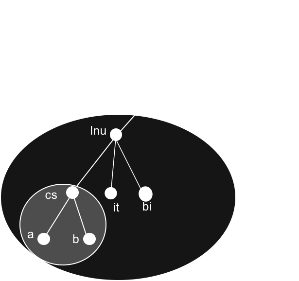
<!-- {_style="position: absolute; top: 240px; left: 300px;"} -->


--
## DNS - Delegation
* One of the goals in the design of the DNS was to decentralize the administration:
* Parent domain contains only a pointer

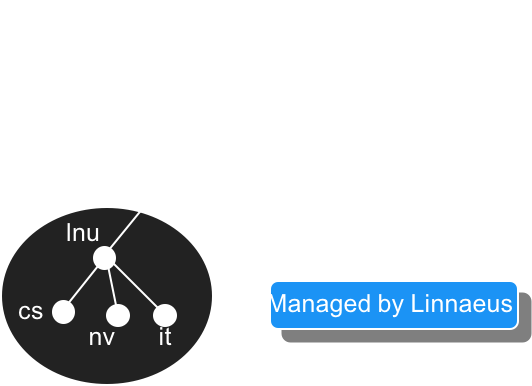
<!-- {_style="position: absolute; width: 50%" class="fragment fade-out"} -->
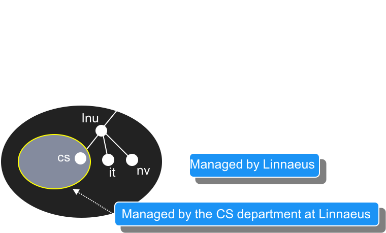
<!-- {_style="float: left; width: 60%" class="fragment fade-in"} -->


--
## DNS - Zones
* Contains all domain names in the domain, except for domain names in delegated subdomains
* Name servers loads the zone is not the domain
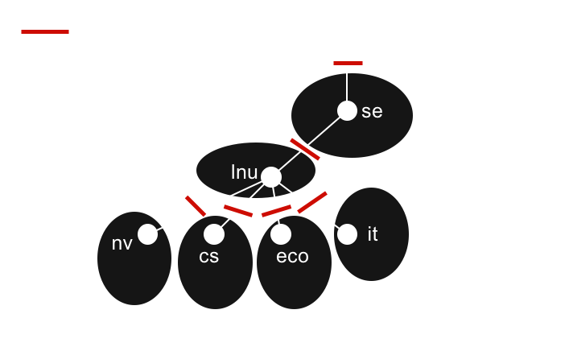

Note:
Zoner:
 innehåller alla domännamn i domänen med samma namn, förutom domännamn i delegerade subdomäner
 namnservrar laddar in zoner istället för domäner eftersom en domän kan innehålla mer information än vad namnservern behöver. En domän kan innehålla data som har blivit delegerade till en annan namnserver
 eftersom zoner är sammanbundna genom delegering kommer en zon aldrig innehålla delegerad data
 skulle en rotnamnserver ladda in en domän istället för en zon, skulle den ladda hela namnområdet


--
## DNS - Name servrer and zones
* Name server = "Server application" that store information about the zone
* Loaded from a file or another name server
* Responsibility for the zone
* May be responsible for multiple zones

Note:
Namnservrar och zoner:
 program som sparar information om domännamnområdet kallas namnservrar
 namnservrar har generellt all information av en del av domännamnområdet, detta området kallas en zon
 informationen laddas in från en fil eller en annan namnserver
 namnservern sägs ha ansvar (authority) för zonen den har information om. En namnserver kan vara ansvarig för flera zoner.


--
## DNS -  Name server
Types of name servers:
* Primary Master
  * The primary name server loads zone data from the zone file
  * Read and Write access to the zone file
* Secondary Master <!-- {_class="fragment"} -->
  * Read only
  * The secondary name server loads zone data from the primary name server or another secondary name server
  * When the secondary name server starts up, contact the their "master" server, and if necessary, it downloads zone data, this is called "zone transfer".

<!-- {_style="width: 65%"} -->


--
## DNS - Lookup Zones
* Forward lookup zones
 * Domain names to IP addresses
 * Resource Record Types
   * A or AAAA (Host)
   * CNAME(Alias)
   * NS (Name Server)
   * SOA(Start of Authority)
   * MX (Mail Exchanger)
   * TXT (Text record)
* Reverse lookup zones <!-- {_class="fragment"} -->
 * IP addresses to domain names
 * Resource Record Types
   * PTR (Pointer)


--
## DNS - Resource Record Types
* A or AAAA record
  * Address record
  * Identifies the IP address from a hostname
  * www.lnu.se. -> 194.47.110.233
* CNAME <!-- {_class="fragment"} -->
  * Canonical name record
  * A host name is the alias for a different hostname
  * www.lnu.se. -> lnu.se.
* Name Server (NS) record  <!-- {_class="fragment"} -->
  * Identifies the Name server for a zone
  * cs.lnu.se.-> ns1.cs.lnu.se.
  * lnu.se -> ando.lnu.se.


--
## DNS - Resource Record Types
* SOA
  * Start of Authority
  * The name server has the best information on DNS zone
  * Make sure the server is responsible (authoritative) for the DNS zone
  * An SOA record is required in all DNS zones
  * Only one SOA record per DNS zone
  * Includes
    * Primary name server
    * Email of the domain administrator
    * Domain serial number
    * Several timers relating to refreshing the zone.


--
## DNS - Resource Record Types
* MX record
  * Mail Exchanger
  * Identifies which server is the mail server for a domain
  * lnu.se -> 10 e-mailfilter03.sunet.se.
* PTR record <!-- {_class="fragment"} -->
  * Pointer
  * Translating IP to domain name
  * 194.47.172.11 -> challenger1.lnu.se.
* TXT record <!-- {_class="fragment"} -->
  * Text record
  * Originally for arbitrary human-readable text
  * lnu.se -> "v=spf1 +mx +exists:%{ir}.%{v}.%{l}.at.%{o}.spf.lnu.se -ip4:124.248.222.0/24 ?all"


--
## DNS Zone files
* Not a standard
* Example zone file

```
$TTL 300
example.org.    IN      SOA      ns1.example.org. admin.example.org. (
                        2006051501      ; Serial
                        10800           ; Refresh
                        3600            ; Retry
                        604800          ; Expire
                        300             ; Negative Response TTL
                )
; DNS Servers
                IN      NS      ns1.example.org.
                IN      NS      ns2.example.org.
; MX Records
                IN      MX 10   mx.example.org.
                IN      MX 20   mail.example.org.

                IN      A       192.168.1.1
; Machine Names
ns1             IN      A       192.168.1.2
ns2             IN      A       192.168.1.3
mail            IN      A       192.168.1.5
; Aliases
www             IN      CNAME   example.org.
```
<!-- {_style="font-size: 33%; margin: 0px; width:50%"} -->


--
## DNS - Caching
* Performance
* Time To Live:  <!-- {_class="fragment"} -->
  * Max time
  * Long TTL <!-- {_class="fragment"} -->
    * Pros
    * Cons
  * Short TTL <!-- {_class="fragment"} -->
    * Pros
    * Cons

<!-- {_style="font-size: 100%"} -->

Note:
Caching:
Det kan tyckas att översättningsprocessen är invecklad och därför borde vara långsam men så är inte fallet utan den är vanligtvis relativt snabb. Något som ökar sökprestandan ännu mer är caching.
När en namnserver utför rekursiva frågor kan den vara tvungen att sända ett antal frågor för att hitta ett svar. Under sökprocessen hittar namnservern mängder med information om namnområdet. Varje gång namnservern refereras till en lista med namnservar lär sig servern att de servrarna är ansvariga för någon zon samt adresserna till namnservrarna. Information som namnserven lär sig sparas i cachen för att det i framtida sökningar ska gå snabbare att hitta informationen.
Det finns även negativ caching implementerat i Microsoft DNS-server. Om en ansvarig namnserver svarar på en fråga med ett svar som säger att domännamnet eller datatypen i frågan inte existerar kommer den lokala namnservern att temporärt lagra den informationen i cachen.
Namnservern cachar data för att snabba upp exekverings tiden på frågor. Om informationen finns i cachen så svarar namnservern direkt, och om namnservern bara känner till den ansvariga namnservern för zonen så skickas en fråga direkt till den ansvariga namnservern istället för att först skicka en fråga till en rotserver vilket snabbar upp förfrågan.
Time To Live:
Eftersom den struktur som DNS-hierarkin beskriver är dynamisk, d.v.s. den ändrar sig kontinuerligt, så är det inte lämpligt att lagra information i cachen i all evighet eftersom informationen som ligger i cachen då kommer att ge en missvisande bild av DNS-hierarkin
För att inte informationen i cachen ska bli för gammal så sätts en maxtid för hur länge informationen får ligga i cachen, denna tiden är känd som Time To Live (TTL)
När TTL-tiden har gått ut måste namnservern radera informationen från cachen och hämta ny data från den ansvariga namnservern. Detta gäller även negativ cachad data.
Att bestämma TTL-värdet för din data är viktigt när det gäller förlikningen mellan prestanda och korrekthet:
Ett mindre TTL-värde kommer hjälpa till att försäkra att data i zonen är korrekt i hela nätverket, eftersom namnservern då kommer att behöva fråga fjärran namnservrar oftare p.g.a. att TTL-tiden löper ut oftare
Det negativa med att TTL-värdet sänks är att belastningen på namnservrarna ökar och medeltiden för en sökprocess i din zon ökar
Ett stort TTL-värde kommer att minska medeltiden för en sökprocess i din zon eftersom data lagras längre i cachen, nackdelen är att data i din zon kommer att bli icke korrekt under en längre period om du utför ändringar på data på din namnserver


--
## DNS - Use cases
* Public
  * Set up the Name Server
    * configure the zone for the domain
    * create a secondary name server
  * Buy the domain name from a register
    * Point the delegation to your Name servers
  * Create records for publicly accessible devices
* Internal/Private <!-- {_class="fragment"} -->
  * you can use any TLD but not recommended
  * use a subdomain under your public domain name
    * Delegate the control to your internal Name servers
  * Create records for internal devices


--
### What happens when we try to visit a website
www.google.com


--
## Internet protocol suite
The web is an application running on the Internet <br />
HTTP is an application protocol running on the TCP/IP stack

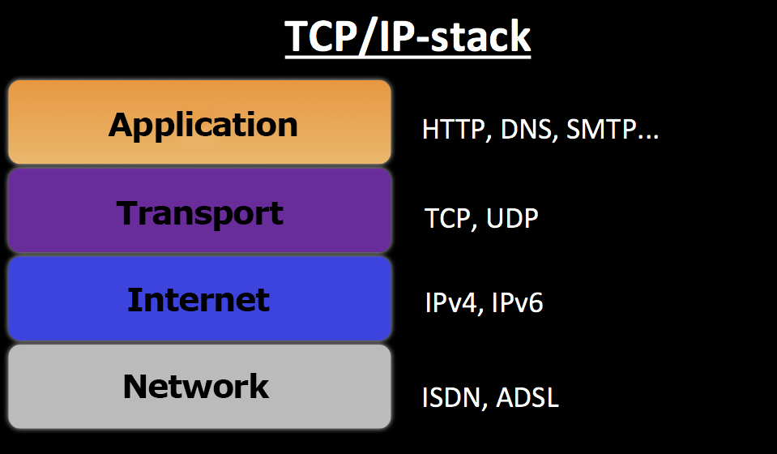
<!-- {_style="width:60%"} -->


--
## Request - Response
* Client / server architecture
* Request / Response
* Stateless, no session
* No built-in security

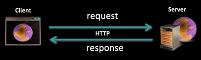
<!-- {_style="width:60%"} -->


--
## Status codes - Server to client
* 1xx - Informational
 * 101 Switching Protocols
* 2xx - Successful
 * 200 OK, 201 Created, 204 No Content
* 3xx - Redirection
 * 302 Found (follow "Location"), 304 Not Modified
* 4xx - Client Error
 * 400 Bad request, 401 Unauthorized
* 5xx - Server Error
 * 500 Internal Server Error


--
## Web Servers

* Server software that understands HTTP/HTTPS
* Serve static web resources
  * Reading from file system
  * Documents, static files, streaming media
* Serve dynamic web resources
  * Support server-script languages like PHP, C# (ASP.NET)...
  * Render web data on-the-fly (HTML, JSON...)
  * Communicate with databases
  * Send request to other servers


--
## Web Servers - Terminology
* Reverse proxy
* Load balancer
* SSL
* Static/Dynamic content
* URL
* Virtual hosting (multiple domain names)


--
## Web Servers
Reverse proxy
* Hide the origin server or servers
* Firewalls can protect against common web-based attacks, such as DOS or DDOS
* Distribute the load from incoming requests to several servers
* Reduce load on its origin servers by caching content

<!-- {_style="width:70%"} -->


--
## Web Servers
Virtual hosting
* Multiple web sites on one server
  * Name-based
  * IP-based
  * Port-based


---
# Directory Service
* Central database for storing network resources
  * Each resource on the network is considered an object
  * Information is stored as attributes of that object
  * Information within objects can be made secure
* A directory service defines the namespace for the network
  * Rules that determine how network resources are named
  * The rules specify that the names be unique and unambiguous
  * Distinguished name (DN)

<!-- {_style="font-size:90%; width:65%"} -->

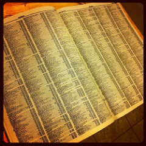 <br />
[CC Image - Adam Lehman](https://www.flickr.com/photos/14519665@N05/)

<!-- {_style="position: absolute; top: 10px; left:1100px; font-size:30%"} -->


--
## Directory Service
LDAP implementations
* Active Directory
* Apache Directory Server
* eDirectory
* Red Hat Directory Server
* OpenLDAP


--
## Active Directory
* Active Directory Services
  * Domain Services
  * Lightweight Directory Services
  * Certificate Services
  * Federation Services
  * Rights Management Services

Note:
1999, released with Windows 2000 Server edition


--
## Active Directory - Domain Services
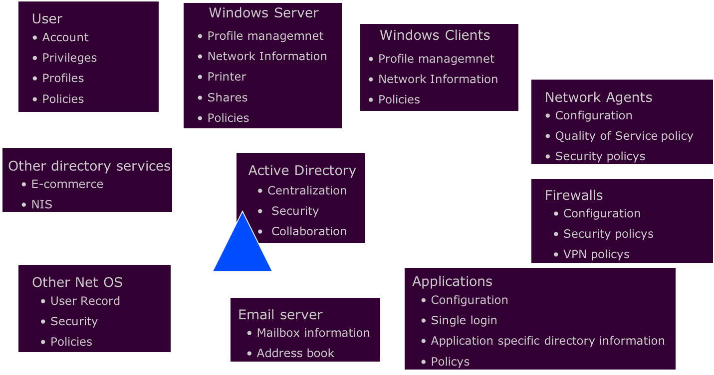


--
## Active Directory - Logical Structure
### Organizational Units (OU)
* is a container for organizing items within a domain
* all domains can maintain its own OU hierarchy
* organizational unit is the smallest container that you can delegate administrative rights

<!-- {_style="width:65%"} -->

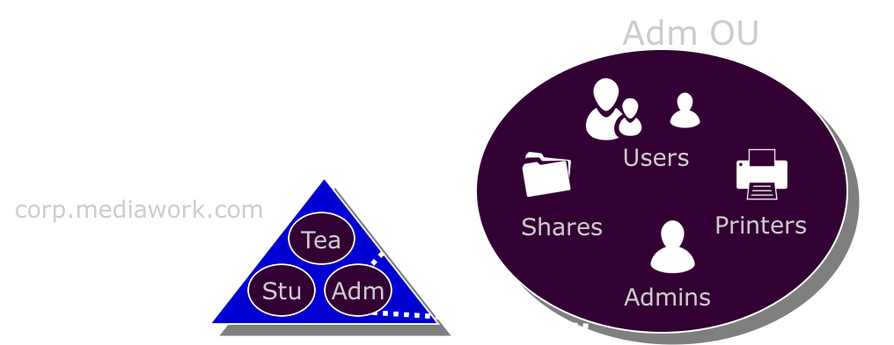
<!-- {_style="width: 800px"} -->


--
## Active Directory - Domain Services
### Group Policy
* Assign centralized policies
* Ensure that a user has the required user environment
* Maintain company policies

<!-- {_style="width:65%"} -->
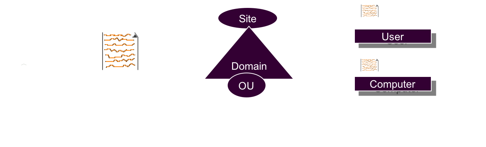
<!-- {_style="width: 900px"} -->


--
## Active Directory - Logical Structure
### What should I use OU for?
1. Organizing
2. Delegation of administration
3. Group Policies

<!-- {_style="font-size:85%"} -->

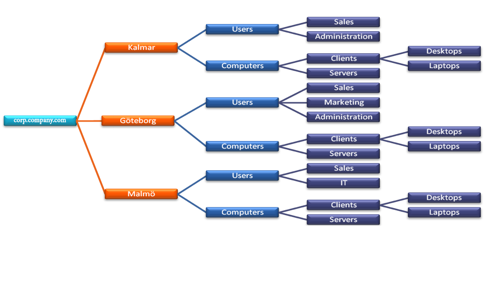
<!-- {_style="position: absolute; top: 350px; left:0px"} -->

Note:
How should you build the OU structure?
  In view of point 2 & 3


--
## Active Directory - Domain Services
### Logon process
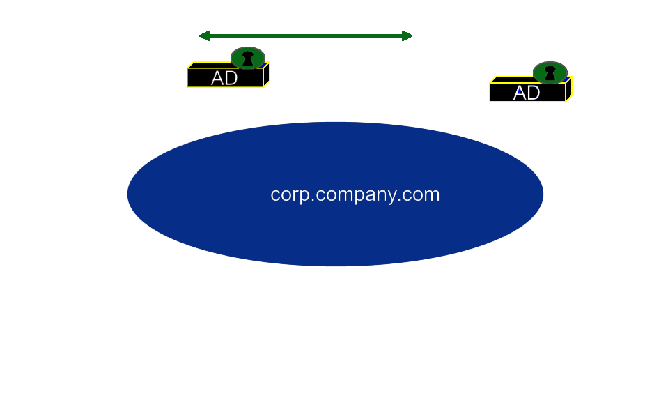
<!-- {_style="width: 800px"} -->


--
## Active Directory - Domain Groups
### Domain Groups
* Created on domain controllers
* Stored in Active Directory
* Used to control access to resources in a domain


--
## Active Directory - Domain Groups
Active Directory supports three group types
* Domain local groups (Local Domain)
  * Authorize within a single domain
  * Members may come from the entire forest
* Global groups (Global)
  * Authorize in the whole forest
  * Members may only come from the same domain as the group
* Universal groups (Universal)
  * Authorize the whole forest
  * Members may come from the entire forest


---
## Cryptography - Basic Principles <!-- {_style="font-size:180%;""} -->
* Confidentiality (Encryption) <!-- {_class="fragment"} -->
* Authentication <!-- {_class="fragment"} -->
* Integrity <!-- {_class="fragment"} -->
* Non Repudiation <!-- {_class="fragment"} -->

<!-- {_style="font-size:150%;"} -->

Note:
Encryption
In a simplest form, encryption is to convert the data in some unreadable form. This helps in protecting the privacy while sending the data from sender to receiver.
Authentication
Suppose, Alice sends a message to Bob and now Bob wants proof that the message has been indeed sent by Alice. This can be made possible if Alice performs some action on message that Bob knows only Alice can do.
Integrity
Now, one problem that a communication system can face is the loss of integrity of messages being sent from sender to receiver. Bob wants to know that the message Alice sent hasn't been modified on the way. This can be achieved by using the concept of cryptographic hash.
Non Repudiation
What happens if Alice sends a message to Bob but denies that she has actually sent the message? Cases like these may happen and cryptography should prevent the originator or sender to act this way. One popular way to achieve this is through the use of digital signatures.


--
## Cryptography - Basic Principles <!-- {_style="font-size:180%;"} -->
### Secret Key Cryptography
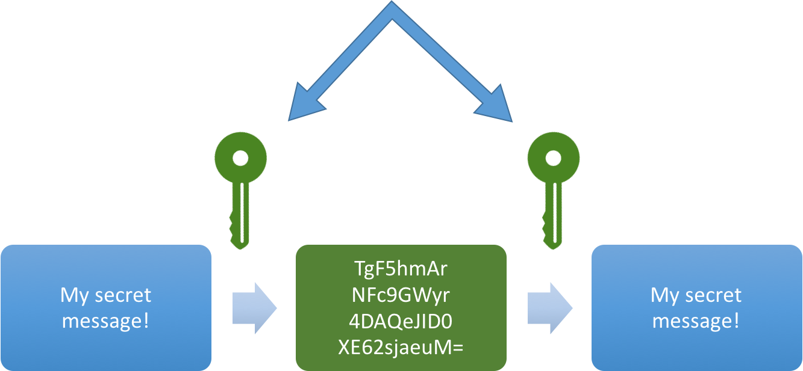<!-- {_style="width:550px;"} -->
* The sender applies a key to encrypt a message <!-- {_class="fragment"} -->
* The receiver applies the same key to decrypt the message <!-- {_class="fragment"} -->
* Only single key is used - symmetric encryption <!-- {_class="fragment"} -->
* The biggest problem with symmetric encryption is distribution of the key <!-- {_class="fragment"} -->


--
## Cryptography - Basic Principles <!-- {_style="font-size:180%;"} -->
### Public Key Cryptography
<!-- {_style="width:600px;"} -->

* Each party has a private key and a public key <!-- {_class="fragment"} -->
* The private is secret and is not revealed while the public key is shared with all those whom you want to communicate with <!-- {_class="fragment"} -->

<!-- {_style="width:70%;"} -->


--
## Cryptography - Basic Principles <!-- {_style="font-size:180%;""} -->
### Hash Functions
* Does not involve any key <!-- {_class="fragment"} -->
* Uses a fixed length hash value that is computed on the basis of the message <!-- {_class="fragment"} -->
* Used to check the integrity of the message to ensure that the message has not be altered,compromised or affected by virus <!-- {_class="fragment"} -->

<!-- {_style="margin-right:25%"} -->
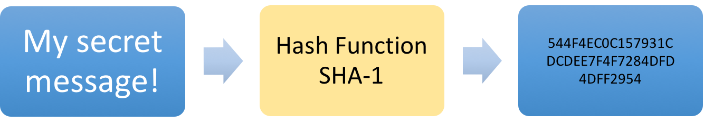<!-- {_style="width:800px;"} -->


--
## Certificates
* Digitally signed documents
* Verifies the validity of the public key <!-- {_class="fragment"} -->
* The user's guarantee that: <!-- {_class="fragment"} -->
  * the public key really belongs to the sender
  * the transmitter holds the private key
* What can be done with the public key <!-- {_class="fragment"} -->


--
## Linux File Permissions
```
user@servername:~$ ls -l
drwxr-xr-x  8 jacob  staff  272 Apr 27 15:49 Admin
-rw-r--r--  1 jacob  staff  162 Apr 27 12:55 README.md
drwxr-xr-x  3 jacob  staff  102 Apr 27 13:17 Students
drwxr-xr-x  4 jacob  staff  136 Apr 28 10:15 libs
-rw-r--r--  1 jacob  staff   49 Apr 28 13:33 newUsers.csv
-rw-r--r--  1 jacob  staff  176 Apr 28 13:33 newUsers.html
```
<!-- {_style="margin: 0px; width:65%"} -->

* r = Read, w = Write, x = Execute <!-- {_class="fragment"} -->
* The first character is the special permission flag that can vary <!-- {_class="fragment"} -->
* The following set of three characters (rwx) is for the owner permissions <!-- {_class="fragment"} -->
* The second set of three characters (rwx) is for the Group permissions <!-- {_class="fragment"} -->
* The third set of three characters (rwx) is for the All Users permissions <!-- {_class="fragment"} -->


--
## Linux File Permissions
### Changing permissions and owner
* `chmod permission filename`
  * r = 4
  * w = 2
  * x = 1
  * -R for recursive
* `chown owner:group filename` <!-- {_class="fragment"} -->

```
user@servername:~$ chmod 600 README.md
user@servername:~$ chown calle:student README.md
user@servername:~$ ls -l
drwxr-xr-x  8 jacob  staff   272 Apr 27 15:49 Admin
-rw-------  1 calle  student 162 Apr 27 12:55 README.md
drwxr-xr-x  3 jacob  staff   102 Apr 27 13:17 Students
drwxr-xr-x  4 jacob  staff   136 Apr 28 10:15 libs
-rw-r--r--  1 jacob  staff    49 Apr 28 13:33 newUsers.csv
```
<!-- {_style="margin: 0px; width:65%"} -->


--
## Windows Permissions
* Access Control List (ACL):
  * An ACL is saved for each file and directory on an NTFS volume <!-- {_class="fragment"} -->
  * Contains a list of all user accounts, groups, and computers that have access to the file or directory <!-- {_class="fragment"} -->
  * Describes the type of access that user accounts, groups, and computers <!-- {_class="fragment"} -->
  * The ACL must contain an Access Control Entry (ACE) for the user account, group, or computer that the user belongs to access the file or directory <!-- {_class="fragment"} -->
  * User accounts that are not on the ACL list is implicitly denied access to the file or directory <!-- {_class="fragment"} -->
  * Users who are denied access in the ACL list is explicitly denied access to the file or directory <!-- {_class="fragment"} -->

<!-- {_style="width:65%"} -->


--
## Role-based Access Control
* Do not assign permissions directly to individual user accounts <!-- {_class="fragment"} -->
* Individuals acquire access through their roles within an organization <!-- {_class="fragment"} -->

<br />
### Active Directory AGDLP <!-- {_class="fragment"} -->
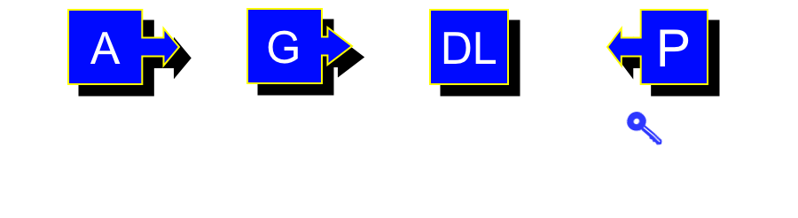 <!-- {_class="fragment"} -->
