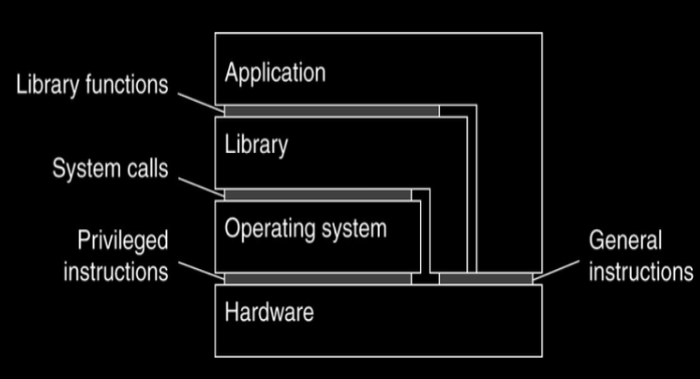
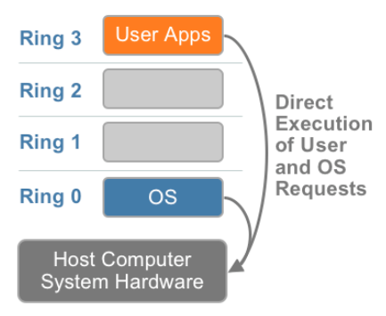
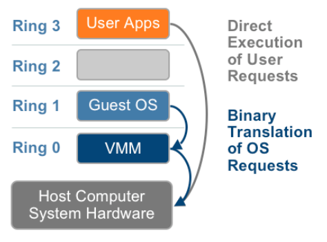
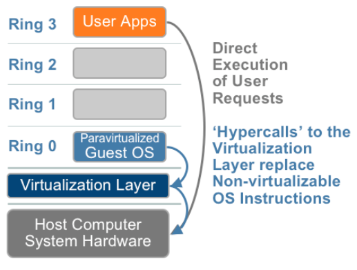
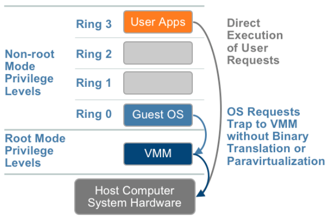

<!-- Start -->
# Today's lecture <!-- {_style="font-size:140%"} -->
* Virtualization

Note:
These are the topics for todays lecture.

---
# Computer Architecture
* Levels of abstraction
* Simplified Interface for underlying resources
* Example: Filesystem is an abstraction for hard drives

Source: Virtual Machines by Jim Smith & Ravi Nair, Edition 2005

<!-- {_style="text-align: right; font-size:70%"} -->

--
## Components of operating systems
### Operating System Architecture

--
# What is Virtualization?

--
## Benefits of Virtualization
* Share resources
    * resource optimization, multiplexing
    * dynamic workload balancing
    * maximizing uptime
    * redundancy for server failure
    * application isolation
* Cost Benefit
    * hardware independence
    * consolidating powerful machines
    * run on legacy systems

Source: [Oracle](https://docs.oracle.com/cd/E27300_01/E27309/html/vmusg-virtualization-reasons.html) 

<!-- {_style="text-align: right; font-size:70%"} -->

--
# Hypervisor
* Originally Virtual Machine Monitor (VMM)
* OS was called supervisors, code to supersede OS to allow programmer debugging
* Properties for ideal VMM
    * Fidelity – identical environment
    * Isolation – complete control
    * Performance – same for VM vs physical

Source: Virtualization Essentials by Matthew Portnoy, Edition 2012
<!-- {_style="text-align: right; font-size:70%"} -->

--
# Type 1 Hypervisor
* Runs on bare metal, direct communication with H/W l Better performance
* More secure and reliable
* Examples: 
    * Xen
    * MS Hyper-V
    * VMWare ESX

Source: Virtualization Essentials by Matthew Portnoy, Edition 2012
<!-- {_style="text-align: right; font-size:70%"} -->

--
# Type 2 Hypervisor
* Runs atop an OS, communicates with the OS 
* Less efficient and low performance
* Less reliable because of host OS
* Examples: 
    * VirtualBox
    * VMWare Station
    * Virtual Server

Source: Virtualization Essentials by Matthew Portnoy, Edition 2012
<!-- {_style="text-align: right; font-size:70%"} -->

--
## x86 without virtualization

<!-- {_style="float: right"} -->

* OS are designed to run on bare-metal
* OS assumes that they own H/W
* OS needs to run Privileged Instructions (PI’s) on H/W
* Tricky bit was how to trap these PI’s
      

Source: [VMware - Understanding Virtualization](https://www.vmware.com/content/dam/digitalmarketing/vmware/en/pdf/techpaper/VMware_paravirtualization.pdf)

<!-- {_style="text-align: right; font-size:70%"} -->

--
## Full virtualization

<!-- {_style="float: right"} -->

* Translates kernel code to replace non-
     virtualizable instructions
* Guest OS is not aware and not modified
* OS instructions - translated on fly and cached
* User instructions – run unmodified
      

Source: [VMware - Understanding Virtualization](https://www.vmware.com/content/dam/digitalmarketing/vmware/en/pdf/techpaper/VMware_paravirtualization.pdf)

<!-- {_style="text-align: right; font-size:70%"} -->

--
## Paravirtualization

<!-- {_style="float: right"} -->

* Guest OS kernel is aware and and modified
* Replaces non- virtualizable instructions
* Hypercalls – communicate directly with hypervisor
* User instructions – run unmodified
* also called "OS Assisted Virtualization"
      

Source: [VMware - Understanding Virtualization](https://www.vmware.com/content/dam/digitalmarketing/vmware/en/pdf/techpaper/VMware_paravirtualization.pdf)

<!-- {_style="text-align: right; font-size:70%"} -->

--
## Hardware Assisted Virtualization

<!-- {_style="float: right"} -->

* Needs special H/W
* Intel VT-x , AMD-V
* PI’s automatically trapped and 
     directly executed
* No binary transalation 
* Dependent on VMM
      

Source: [VMware - Understanding Virtualization](https://www.vmware.com/content/dam/digitalmarketing/vmware/en/pdf/techpaper/VMware_paravirtualization.pdf)

<!-- {_style="text-align: right; font-size:70%"} -->

--
# Containers
Containers are another virtualization technique. They provide isolation at the pro- cess level instead of the machine level. While a VM is a machine that shares physical hardware with other VMs, each container is a group of processes that run in iso- lation on the same machine. All of the containers run under the same operating system, but each container is self-contained as far as the  les it uses. Therefore there is no dependency hell.
Containers are much lighter weight and permit more services to be packed on fewer machines. Docker, Mesos, and Kubernetes are popular systems for man- aging large numbers of containers. They all use the same container format, which means once a container is created, it can be used on a desktop, server, or huge farm of servers.

Pros and cons of virtualization and containerization, as well as technical details of how they work, can be be found in Volume 2, Chapter 3, “Selecting a Service Platform,” of this book series.
Self-service container administration is made possible by Kubernetes and other container management systems. Customers provide the container speci-  cation and the management system  nds an available machine and spins up the container.
One bad situation people get into with containers is a lack of reproducibil- ity. After using the system for a while, there comes a day when a container needs to be rebuilt from scratch to upgrade a library or other  le. Suddenly the team

realizes no one is around who remembers how the container was made. The way to prevent this is to make the container’s creation similar to compiling software: A written description of what is to be in the container is passed through automation that reads the description and outputs the container. The description is tracked in source code control like any other source code. Containers should be built using whatever continuous integration (CI) system is used for building other software in your organization.
