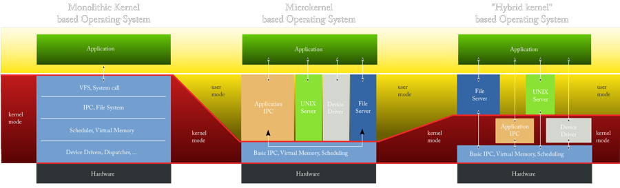
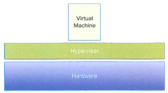
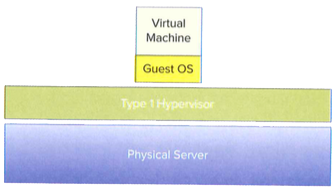
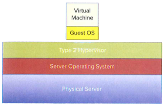
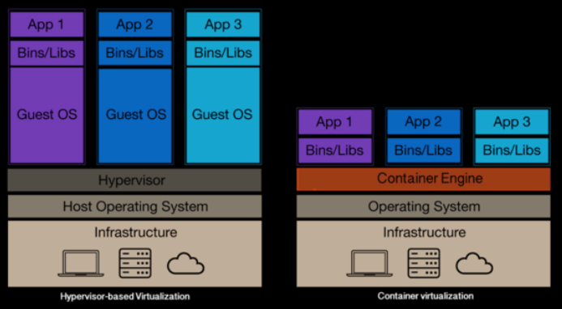

<!-- Start -->
# Today's lecture <!-- {_style="font-size:140%"} -->
## Virtualization
* Virtual Machines
    * What is Virtual Machines?
    * Benefits of Virtual Machines
    * Understanding Virtual Machines
* Containers
    * What is a Container?
    * Virtual Machines vs. Containers
    * Understanding containers

Note:
These are the topics for todays lecture.

---
# Computer Architecture
* Levels of abstraction
* Simplified Interface for underlying resources
* Example: Filesystem is an abstraction for hard drives

Source: Virtual Machines by Jim Smith & Ravi Nair, Edition 2005

<!-- {_style="text-align: right; font-size:70%"} -->

--
## Components of operating systems
### Operating System Architecture

--
## What is Virtual Machines?
> Virtual machines are created when a physical machine is partitioned to run a separate operating system for each partition. 

Source: The Practice of Cloud System Administration

<!-- {_style="text-align: right; font-size:70%"} -->
Note:
Processes running in a VM have **no awareness** that they are nte running on a physical machine 
Can **not access the resources**, disk, memory, of other VMs on the same physical machine

--
## Benefits of Virtual Machines
* Share resources
    * resource optimization, multiplexing
    * dynamic workload balancing
    * maximizing uptime
    * redundancy for server failure
    * application isolation
* Cost Benefit
    * hardware independence
    * consolidating powerful machines
    * run on legacy systems

Source: [Oracle](https://docs.oracle.com/cd/E27300_01/E27309/html/vmusg-virtualization-reasons.html) 

<!-- {_style="text-align: right; font-size:70%"} -->
Note:
VMs can make computing more efficient. Physical machines today are very fast and powerful, applications don't use all the resources, this excess capacity is usually called **stranded capacity**  
VMs provide better **isolation** than simple multitasking  
Cons: performance and overhead

--
## Understanding Virtual Machines
### Hypervisor

<!-- {_style="float: right"} -->

* Originally Virtual Machine Monitor (VMM)
* OS was called supervisors, code to supersede   OS to allow programmer debugging
* Properties for ideal VMM
    * Fidelity – identical environment
    * Isolation – complete control
    * Performance – same for VM vs physical

Source: Virtualization Essentials by Matthew Portnoy, Edition 2012
<!-- {_style="text-align: right; font-size:70%"} -->
Note:
**First VMM** were used for the development abd debugging of OS.

--
# Type 1 Hypervisor

<!-- {_style="float: right"} -->

* Runs on bare metal, direct communication with H/W 
* Better performance
* More secure and reliable
* Examples: 
    * Xen
    * MS Hyper-V
    * VMWare ESX

Source: Virtualization Essentials by Matthew Portnoy, Edition 2012
<!-- {_style="text-align: right; font-size:70%"} -->
Note:
Less overhead 
Cost

--
# Type 2 Hypervisor

<!-- {_style="float: right"} -->

* Runs on top of an OS, communicates with the OS 
* Less efficient and low performance
* Less reliable because of host OS
* Examples: 
    * VirtualBox
    * VMWare Station
    * Virtual Server

Source: Virtualization Essentials by Matthew Portnoy, Edition 2012
<!-- {_style="text-align: right; font-size:70%"} -->
Note:
The **first x86** offerings were Type 2, quickest path to market, the host OS already handled all the hardware communication.

--
## x86 without virtualization

<!-- {_style="float: right"} -->

* OS are designed to run on bare-metal
* OS assumes that they own H/W
* OS needs to run Privileged Instructions (PI’s) on H/W
* Tricky bit was how to trap these PI’s
      

Source: [VMware - Understanding Virtualization](https://www.vmware.com/content/dam/digitalmarketing/vmware/en/pdf/techpaper/VMware_paravirtualization.pdf)

<!-- {_style="text-align: right; font-size:70%"} -->

--
## Full virtualization

<!-- {_style="float: right"} -->

* Translates kernel code to replace non-
     virtualizable instructions
* Guest OS is not aware and not modified
* OS instructions - translated on fly and cached
* User instructions – run unmodified
      

Source: [VMware - Understanding Virtualization](https://www.vmware.com/content/dam/digitalmarketing/vmware/en/pdf/techpaper/VMware_paravirtualization.pdf)

<!-- {_style="text-align: right; font-size:70%"} -->

--
## Paravirtualization

<!-- {_style="float: right"} -->

* Guest OS kernel is aware and and modified
* Replaces non- virtualizable instructions
* Hypercalls – communicate directly with hypervisor
* User instructions – run unmodified
* also called "OS Assisted Virtualization"
      

Source: [VMware - Understanding Virtualization](https://www.vmware.com/content/dam/digitalmarketing/vmware/en/pdf/techpaper/VMware_paravirtualization.pdf)

<!-- {_style="text-align: right; font-size:70%"} -->

--
## Hardware Assisted Virtualization

<!-- {_style="float: right"} -->

* Needs special H/W
* Intel VT-x , AMD-V
* PI’s automatically trapped and 
     directly executed
* No binary translation 
* Dependent on VMM
      

Source: [VMware - Understanding Virtualization](https://www.vmware.com/content/dam/digitalmarketing/vmware/en/pdf/techpaper/VMware_paravirtualization.pdf)

<!-- {_style="text-align: right; font-size:70%"} -->

---
# Containers
> A container is a group of processes running on an operating system that are isolated from other such groups of processes.

Source: The Practice of Cloud System Administration

<!-- {_style="text-align: right; font-size:70%"} -->

--
# Containers
* Containers are another virtualization technique
    * Not light-weight VM’s
* Isolation at the process level instead of the machine level
* Containers run under the same operating system/kernel
* Provides a virtual operating system not a VM with own CPU, memory, I/O

Note:
The analogy we use here at Docker is comparing houses (virtual machines) to apartments (Docker containers). 
**Houses** (the VMs) are fully **self-contained and offer protection from unwanted guests**. They also each possess their **own infrastructure** – plumbing, heating, electrical, etc. Furthermore, in the vast majority of cases houses are all going to have at a **minimum a bedroom, living area, bathroom, and kitchen**. It’s incredibly difficult to ever find a “studio house” – even if one buys the smallest house they can find, they may end up buying more than they need because that’s just how houses are built. 
**Apartments** (Docker containers) also offer **protection from unwanted guests**, but they are built around **shared infrastructure**. The apartment building (the server running the Docker daemon, otherwise known as a Docker host) offers shared plumbing, heating, electrical, etc. to each apartment. Additionally apartments are offered in **several different sizes** – from studio to multi-bedroom penthouse. *You’re only renting exactly what you need.*

--
## Virtual Machines vs. Containers

Source: [Docker - What is Docker](https://www.docker.com/what-docker#/VM)

<!-- {_style="text-align: right; font-size:70%"} -->

--
## Virtual Machines vs. Containers
Containers and VMs Together

Source: [Docker for the Virtualization Admin](https://goto.docker.com/docker-virtualization-admin-ebook.html)

<!-- {_style="text-align: right; font-size:70%"} -->

--
## Benefits of Containers
* Ease of Use – build once, run anywhere
* Speed – lightweight, less resources, boot time
* Distribution – make them publicly available
* Modular and Scalable – a container for each service

--
## Understanding Containers
* Containers are isolated from each other
* The processes all run under the same operating system
    * You can't have one process under Linux an another on Windows
* Do not allocate large chunk of RAM and disk
* Processes in a container are:
    * controlled as a group
    * only allows to interact with processes within the container
* Each container has its own copy of packages, shared libs and other required files

Source: The Practice of Cloud System Administration

<!-- {_style="text-align: right; font-size:70%"} -->

Note:
* Own Namespace, chroot (Subdir), network
* Not as wasteful as VMs
* If the container is configured to have a memory limit, the sum total of memory used by all processes in the container can't exceed that limit.
* Processes that are not in a container can kill or interact with all processes.
* Dependency hell is avoided