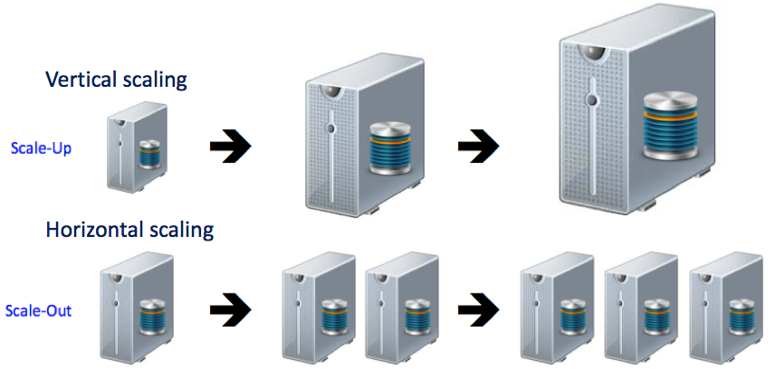
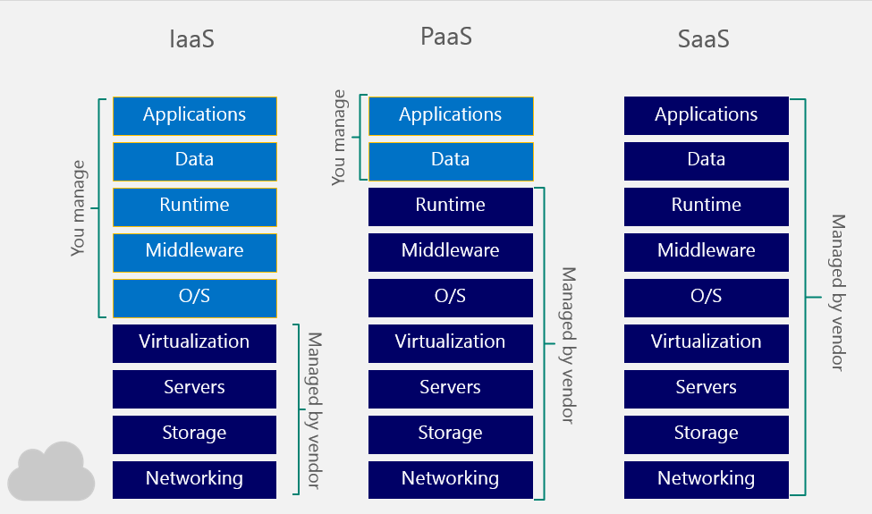

<!-- Start -->
## Today's lecture

* Definition of "The Cloud"
    * Characteristics
    * History
    * Basic concepts
* Cloud Services
* Deploy models
* Business drivers
* Challenges

Note:
These are the topics for todays lecture.

---

<!-- {_class="center"} -->

Cloud computing?<!-- {_style="text-align: center; font-size:55%"} -->

Note:
Osäkert vad själva ordet/begreppet kommer ifrån. Bild på moln för att beskriva helhet utan att gå in i detaljer. Nätverksschema förr ritade servrar som cirklar => serverkluster => såg ut som ett moln. 
Hur vi kommer i kontakt med molntjänster idag? 
Bygga system. Webbhotel vs. VPS, virtualisering. Förtsättning från förra veckan

--
## Definition
> Cloud computing is a model for enabling ubiquitous, convenient, *on-demand* network access to a *shared pool* of configurable computing resources (e.g., networks, servers, storage, applications, and services) that can be rapidly provisioned and released with minimal management effort or service provider interaction. This cloud model is composed of five essential characteristics, three service models, and four deployment models.

Source - [NIST (National Institute of Standards and Technology) Definition(http://nvlpubs.nist.gov/nistpubs/Legacy/SP/nistspecialpublication800-145.pdf)]  Mell and Grance

<!-- {_style="text-align: center; font-size:40%"} -->

--
## Characteristics

* On-demand self-service
  * A customer can get computing capabilities (server time, network storage) automatically without human interaction with the service provider.
* Broad network access
  * The services are available over the network and accessed through standard mechanisms (thin or thick client)
  * Programmable API
* Resource pooling
  * Pooled to serve multiple consumers using a multi-tenant model, with different physical and virtual resources dynamically assigned and reassigned according to the consumers demand

--
## Characteristics

* Rapid elasticity
  * Services (Servers) can be rapidly and elastically created. They can automatically scale in and out.
* Measured service
  * Cloud systems can automatically control and optimize resources by using a metering capability. Measuring storage, processing, bandwidth...

<!-- {_style="width:55%"} -->

<!-- {_class="center"} -->

--
## History
* The idea of delivering computing resources through a global network is rooted in the 1960s.
* John McCarthy (1961)
    * "computers of the future...someday be organised as a public utility..."
    * "Mainframe timesharing"
* “Intergalactic computer network” - Running applications and services from ARPANET
* Distributed computing
  * a group of independent and geographically dispersed computer systems take part to solve a complex problem
* Grid computing
  * A service for sharing computer power and data storage capacity over the Internet

--
## History
* Search engines 1993 (AltaVista, Lycos, InfoSeek), Web-based e-mail 1994
* Salesforce.com in 1999, the concept of delivering enterprise applications via a simple website.
* Amazon Web Services in 2002, which provided a suite of cloud-based services including storage, computation...
  *  2006, Amazon launched its Elastic Compute cloud (EC2)
* "Web 2.0" - Google and others started to offer browser-based enterprise applications, though services such as Google Apps.

Note:

---
## Service models (the big three)

* SaaS
  * Software as a Service
  * Consumers uses the providers application that runs on a cloud infrastructure
    * Google docs, Cloud9, hotmail...
* PaaS
  * Platform as a Service
  * The consumer can deploy their own applications into the provided cloud infrastructure.
    * Google App Engine, Heroku, WS Elastic Beanstalk, Windows Azure
* IaaS
  * Infrastructure as a Service
  * The consumer can use processing, storage, network and other fundamental computing resources. The consumer can create servers and run there own applications in the cloud.
    * Windows Azure, AWS, Digital Ocean

--

## Deployment models

* Private cloud
  * The cloud is used only by one organization
* Community cloud
  * The cloud infrastructure is shared between several organizations that has shared concerns.
* Public cloud
  * The cloud infrastructure is made available to the general public or a large group of **cloud consumers** and is owned by a **cloud provider** selling cloud services.
* Hybrid cloud
  * The cloud infrastructure is a composition of two or more clouds (private, public or community). Bound together by technology that enables data portability.

--

## Deployment models...

* Public IaaS cloud
  * Amazon AWS, Digital Ocean
* Community IaaS cloud
* Private IaaS
  * Open Stack, CloudStack

--

<!-- {_class="center"} -->

--
## Cloud resources

* Compute
  * Mainly server instances - Create and restore VMs
  * Calculating capacity - FaaS (function as a service)
* Storage Resources
  * Block Storage
    * Mounted on server instances, Appears as an local disk drive but are often allocated from the network ( = there will be latency)
    * Ex. [Amazon EBS](https://aws.amazon.com/ebs/), [OpenStack Cinder](https://wiki.openstack.org/wiki/Cinder)
  * Object Storage
    * Files can be stored and accessed from different parts of the infrastructure or publicly
    * Designed for long-term storage often accessed from different servers (CDN)
      * [Amazon S3](https://aws.amazon.com/s3/), [Openstack Swift](https://wiki.openstack.org/wiki/Swift)
* Network Resources
  * Manage connectivity between its own elements and with external networks
  * Internal routing, load balancing, security - Automated?
  * [Software-defined network](https://en.wikipedia.org/wiki/Software-defined_networking) - Programmable infrastructure

--

  

  <!-- {_class="center"} -->

---
## Why using Cloud?
* Cost
  * Someone else is taking care of stuff
    * Avoiding overheads
    * Licencing
    * Security (?)
  * Flexibility - better use of resources
  * Service availability
* Data
  * Storage infrastructure
  * backups, recovery

--
## Why using Cloud?
* Capacity planning
  * Demand for a service may varies with time
    * Pay-as-you-go
  * Upgrading infrastructure for new products
  * Data migration
* Environmentally friendly?
  * Leading to new energy solutions
  * Localization of "cloud data centers"

--

## Challenges!
* Legal and constraints on hosting location
  * Who will see it?
  * Sensitive data, personal integration, legal issues
* When I delete data is it deleted?
  * Transparency how data is handle
* SaaS is often free....or?
  * Is Google Docs free? Is Facebook?
          

--

## Challenges!

* Portability
  * How to change cloud provider?
  * Data lock-in, What if the provider will shut down?
  * Data Transfer Bottlenecks?
    * The cost of big data transfer
    * Ship disk?
* How to handle variable capacity?
  * Support
  * Cost
* Private or public?

--
## Next time...

<!-- {_class="center"} -->

---
 

<!-- {_class="center"} -->
