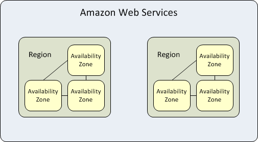

<!-- Start -->
## Today's lecture

* Definition of "cloud"
    * Characteristics
    * Basic concepts and terminology
* Cloud Services
    * Cases
* Deploy models
* Business drivers
* Challenges
* Some about capacity planning

Note:
These are the topics for todays lecture.


---
### The cloud?


<!-- {_class="center"} -->

<!--Cloud computing? {_style="text-align: center; font-size:55%"} -->


Note:
Osäkert vad själva ordet/begreppet kommer ifrån. Bild på moln för att beskriva helhet utan att gå in i detaljer. Nätverksschema förr ritade servrar som cirklar => serverkluster => såg ut som ett moln.<br>
Hur vi kommer i kontakt med molntjänster idag?<br>
Bygga system. Webbhotel vs. VPS, virtualisering. Förtsättning från förra veckan


--
## Definition
> Cloud computing is a model for enabling ubiquitous, convenient, *on-demand* network access to a *shared pool* of configurable computing resources (e.g., networks, servers, storage, applications, and services) that can be rapidly provisioned and released with minimal management effort or service provider interaction. This cloud model is composed of five essential characteristics, three service models, and four deployment models.

Source - [NIST (National Institute of Standards and Technology) [Definition](http://nvlpubs.nist.gov/nistpubs/Legacy/SP/nistspecialpublication800-145.pdf)] - Mell and Grance

<!-- {_style="text-align: center; font-size:40%"} -->


--
## Characteristics
* On-demand self-service
  * A customer can get computing capabilities (server time, network storage) automatically without human interaction with the service provider.
* Broad network access
  * The services are available over the network and accessed through standard mechanisms (thin or thick client)
  * Programmable API
* Resource pooling
  * Pooled to serve multiple consumers using a multi-tenant model, with different physical and virtual resources dynamically assigned and reassigned according to the consumers demand


--
## Characteristics
* Rapid elasticity
  * Resources can be rapidly and elastically created. They can automatically scale in and out.
* Measured service
  * Cloud systems can automatically control and optimize resources by using a metering capability. Measuring storage, processing, bandwidth...


---
## Service models (the big three)
* SaaS
  * Software as a Service
  * Consumers uses the providers web-accessible applications
    * Google docs, Salesforce, Github...
* PaaS
  * Platform as a Service
  * The consumer can deploy their own applications into the vendor-provided framework
    * Google App Engine, [Heroku](https://www.heroku.com), WS Elastic Beanstalk
      * charge of CPU time, bandwidth, storage, offer elastic scaling
* IaaS
  * Infrastructure as a Service
  * The consumer can use processing, storage, network and other fundamental computing resources. The consumer can create servers and run there own applications in the cloud.
    * Windows Azure, AWS, Digital Ocean, Google Cloud 
      * charge for compute time, storage, network traffic


--


<!-- {_class="center"} -->


---
## FaaS
* Function as a service
* Runs functionalities of an application
* O ne way of achieving a "serverless" architecture
  * AWS Lambda, Google cloud functions, MS Azure functions...
* Data processing, event-driven workflows
* Charge by execution time


--
### Cloud resources services

* Compute
  * Mainly server instances - Create and restore VMs, container management
    * Scaling, Serverless applications...
* Storage Resources
  * Block Storage
    * Mounted on server instances, Appears as an local disk drive but are often allocated from the network ( = there will be latency)
      * Ex. [Amazon EBS](https://aws.amazon.com/ebs/), [OpenStack Cinder](https://wiki.openstack.org/wiki/Cinder)
  * Object Storage
    * Files can be stored and accessed from different parts of the infrastructure or publicly
    * Designed for long-term storage often accessed from different servers (CDN)
      * [Amazon S3](https://aws.amazon.com/s3/), [Openstack Swift](https://wiki.openstack.org/wiki/Swift)
  * Hot & Cold storage
* Network Resources
  * Manage connectivity between its own elements and with external networks
    * Internal routing, load balancing, Gateways, Scalable DNS...
* Analytics, Migration, Databases, Development tools, Machine learning....


---
* Amazon Web Service ([https://aws.amazon.com/](https://aws.amazon.com/))
  * 2002
  * IaaS, PaaS, SaaS, FaaS...
  * 17 geographical regions, six more to come
    * Each region has multiple "Availability Zones"
    * Each region is completely independent. Each Availability Zone is isolated
    * Availability Zones in a region are connected through low-latency links.



---
* Microsoft Azure ([https://azure.microsoft.com](https://azure.microsoft.com))
  * 2010
  * IaaS, PaaS, SaaS, FaaS...
  * 54 geographical regions, more to come
    * Some regions has multiple "Availability Zones"


--
### Deployment models (resource sharing)

* Private cloud
    * The cloud is used and maintained by only one organization
* Community cloud
  * The cloud infrastructure is shared between several organizations that has shared concerns.
  * Government, health care, companies with needs of same applications
  * [Report about Swedish government cloud](http://www.statenssc.se/omstatensservicecenter/publikationer/rapporter/arkiv/engemensamstatligmolntjanstformyndigheternasitdrift.2106.html)
* Public cloud
  * The cloud infrastructure is made available to the general public or a large group of **cloud consumers** and is owned by a **cloud provider** selling cloud services.
* Hybrid cloud
  * The cloud infrastructure is a composition of two or more clouds (private, public or community). Bound together by technology that enables data portability.
    * Cost, performance, security
    * Avoid vendor lock-ins, easier through containerization?


--
### Choosing Deployment models
* Compliance (sv: överensstämmelse)
  * Regulations depending on business, size, locations
* Privacy
  * Data leakage, accidental exposure
* Cost
  * Total cost of ownership (TCO), Return of Investment (ROI)
  * Using long term or short term
* Control
  * Private give more control, hardware, technologies, data
  * Require more knowledge 


---
## Why using Cloud?
* Cost effective?
  * Pay-as-you-go
  * Someone else is taking care of stuff
    * Avoiding overheads, licensing...
* Flexibility - better use of resources
  * Support new business models
* Service availability
* Data
  * Storage infrastructure, backups, recovery
  * Data migration
* Environmentally friendly?
  * Power, cooling, leading to new energy solutions


--

## Challenges!
* Legal and constraints on hosting location
  * Sensitive data, personal integrity, legal issues
  * What happen when our PaaS is acquired?
* When I delete data is it deleted?
  * Transparency how data is handle
* SaaS is often free....or?
  * Is Google Docs free? Is Facebook?
* Portability
  * Vendor lock-in, What if the provider will shut down?
* ...


---
## Capacity planning
* Chapter 18 (p. 365-378)
* Ensuring enough resources when needed
  * no over- or under capacity
* Avoid services failing, improving cost effectiveness
* Data-driven process
  * Automated collected data from monitoring tools
  * Could be analyzed (advanced) mathematical models


--
* Primary resource
  * Which resource is most critical for a service? CPU? Storage?
    * First step to identify
* Secondary resource
  * Not interesting when calculating capacity but should be monitored 
* Ancillary (sv: underordnad) resource
  * server instances, load balancers, power, other infrastructure components
    * Find the relationship between primary resources and ancillary resources
* Core driver
  * Factors that strongly drive demand for the primary resource
  * QPS
    * Query per seconds
  * MAU
    * Monthly active users
* Time series
  * Sequence of data points measured at time intervals


--
### Standard capacity planning
What are you going to need? When? Yearly calculation for each resource

```
Future resources = 
Current resources x (1 + normal growth + planned growth) + headroom
Additional resources = future resources - current resources
```

* Normal growth (%)
  * Without business or marketing events
  * Calculated by observing historic data (more the better)
* Planned growth (%)
  * Events, campaign, product launch  
* Headroom
  * Short-time spikes (percentage of current capacity)
  * Should be notified by monitoring 


--
#### Capacity model

* Capacity model shows the relationship between core driver and primary resource
  * Try to show how changes in core drivers will affect primary resources
  * Which core driver influence which resource and how strongly - By correlation 1 to -1
  * Regression analysis (sv. Regressionsanalys) on time-series data
* Changes in service will probably change the correlation, needs to be recalculated
* Could be used for forecasting models


<!-- {_class="center"} -->


--
### Formula


<!-- {_class="center"} -->


--
## Next time...


<!-- {_class="center"} -->
