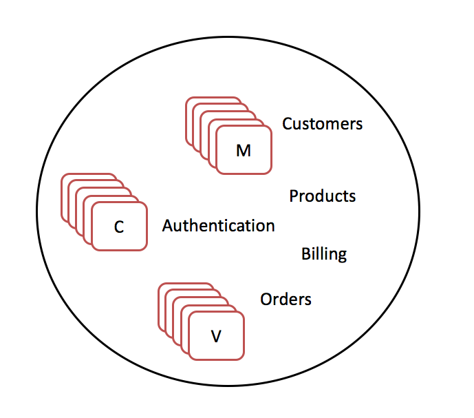
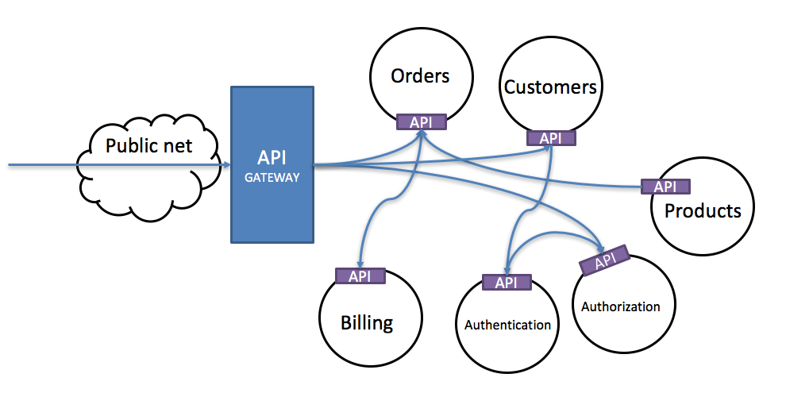

<!-- Start -->
## Today's lecture

* Containers
    * History
    * Containers core concepts
    * From a software perspective
* Docker
  * What is docker
  * Characteristics
  * Basic concepts
* Practical
  * How to install
  * Dockerfile
  * Docker-compose

Note:
These are the topics for todays lecture.


---

## Containers


> "Containers are an important technology that is not going away for a while"

Note:
separated process<br>


--


--
## History

* UNIX - "jail" - modified runtime preventing application accessing protected resources
  * And jails, an early implementation of container technology, was added to FreeBSD., 2000
* Linux-VServer project lacked process migration and clustering, its real weakness was that it required a patched kernel
* 2004, Solaris zones
* 2006, Linuxkernel, The result was generic process containers, which were later renamed control groups, or cgroups
* 2008 user namespaces, processes with own users and root account


--
## History
* The Linux Containers project (LXC), created by engineers from IBM around 2008,
  * LXC provided an improved user experience around containers
  * Since the 1.0 release of LXC in early 2014
  * most complete implementation of Linux container manager.
* LXC userspace tools with even easier to use tooling aimed at developers looking for simple ways to package their applications.
  * Docker, 2015, donated the project’s existing codebase to the Open Container Initiative
* Orchestrating at Scale
  * Kubernetes launched in 2014, Google discussed how “everything at Google runs in a container”
* 2016, CoreOS launches Rocket 1.0


---
## Containers core concepts

* Container manager
  * Tools that help you create a container, deploy it and get it Running
    * Docker, Rocket
* Configuration File
  * A file where the containers (or application) needs is defined
* Layers
  * A container is made up of Layers
    1. A base layer - a base OS (Ubuntu)
    2. A web server (Apache)
    3. An application platform runtime (PHP)
    4. The application code


--
## Containers core concepts
* Images
  * A template of your container defined by the configuration file (and build with layers)
  * Ready to be hosted on one or many hosts
* Registers
  * Stores container images (Docker hub)
  * Gives you reusability
  * Use base images in a layer
* Scaling containers
  * Container loads much more quickly then VMs
  * Load balancing
  * Example; Kubernetes, etcd, Docker swarm


---
## Modern software architecture

* App servers --> PaaS
* Physical machines or VMs --> Containers
* Monolitic apps --> Microservices


--
## Going from monolitics..



<!-- {_class="center"} -->


--
## ..to microservices



<!-- {_class="center"} -->


---
## Docker


<!-- {_class="center"} -->


--
## What is docker?
* Docker provides tooling and a platform to manage containers
* Started in France as an internal project within dotCloud, a platform-as-a-service company
* The world’s leading software container platform
* Focus on minimize the gap from development to deployment
  * Developing, shipping and running
  * Simpler tools, management, scaling and so on
* Minimize the diversion between development- and production Environmentally
  * "It works on my machine"
* The docker platform is "Open Source", Promoted by the Docker, Inc
* Written in GO language (https://golang.org)


--
## Docker - Architecture

* Docker Engine
  * A client-server models
    * Server, docker deamon, creates images, containers, networks and volumes
    * REST API, interface for programs to talk to the deamon
    * A CLI client
      * Could be other tools...communicating with the API


<!-- {_class="center"} -->


--
## Docker - Architecture

* Docker Registries
  * Stores *docker images* (Docker Hub, Docker Cloud)
  * Public or Private
  * Docker store - Buy and sell application or services


<!-- {_style="width:50%"} -->

Source: https://blog.octo.com/en/docker-registry-first-steps/

<!-- {_style="text-align: right; font-size:60%"} -->


--
## Docker basic concepts

* Images
  * read-only templates with instructions for creating a container
  * Often an image is based on another image
  * Get it from Docker Hub or your own registry
  * Defined in a *Dockerfile*
* Containers
  * A runnable instance of an image
  * Relatively well isolated from other containers and its host machines
  * ``` docker run -i -t ubuntu /bin/bash ```
* Services
  * Scaling of containers across multiple Docker deamons (swarm mode)


--
## Docker characteristics

* Layers - Changes are done in layers, not the whole image
  * UnionFS - Used by Docker engine
  * Union File System, Used to layered Docker images
* Single process
* Stateless, read-only
  * How to store data? Volumes!
* Portable


--
## About Volumes
* How to handle dynamic data in a read-only container?
* Docker is using Volumes - Take completely care of them
* Using a volume does not increase the size of containers using it
* A volume could be used by many containers
* By default, not deleted when container is stopped


```bash
## Creates a datacontainer based on ubuntu
docker create -v /logs --name logscontainer ubuntu
## start a container and mounts the volume
docker run -t -i --volumes-from logscontainer ubuntu /bin/bash
## or
docker run -t -i --volumes-from logscontainer centos /bin/bash

# create both volume and container
docker run -v ~/myVolume:/data -it ubuntu /bin/bash
```
https://docs.docker.com/engine/admin/volumes/volumes/


---
## Getting started

* Community Edition (CE) and Enterprise Edition (EE)
  * https://docs.docker.com/engine/installation/
  * Docker for mac, Docker for Windows
  * Read installations instructions for your linux dist.
    * https://docs.docker.com/engine/installation/linux/docker-ce/ubuntu/


<!-- {_style="width:50%"} -->

Source: [docker.com](https://docker.com)

<!-- {_style="text-align: right; font-size:60%"} -->


--
## Is it working?

```bash
docker run hello-world
```


--
## Basic ubuntu container

```bash
docker run -i -t ubuntu /bin/bash
```

Note: 'cat /etc/*release*


---
## The Dockerfile
* In the Dockerfile (a textfile) you define your image from which you build your container(s)
* Contains all the commands needed for the preferred image
* Load and build with ``` docker build .```


--

```
# Nginx Dockerfile

FROM ubuntu:16.04
LABEL maintainer="thajo@lnu.se"

RUN apt-get update \
    && apt-get install -y nginx \
    && apt-get clean \
    && rm -rf /var/lib/apt/lists/* /tmp/* /var/tmp/* \
    && echo "daemon off;" >> /etc/nginx/nginx.conf

EXPOSE 80
CMD ["nginx"]

```

```
docker build . -t thajo/nginx
docker run -p 8080:80 -d thajo/nginx
```

Note:
Each command in a own layer<br>
#Running the build
docker build . -t thajo/rails
# Starting a container
docker run -p 80:80 -d thajo/rails
#stoping
docker stop id


--
# Dockerfile commands

* FROM
  * Defines the base image to work with
* LABEL
  * Meta data about this image (creator, maintainer and so on)
* RUN
  * Specifies one (or combined) commands to run in the shell
* CMD
  * One per file, defaults for an executing container (entrypoint is default /bin/sh)
* COPY
  * Copy files or directory and add them to the containers file system
* ADD
  * Like copy, could use URLs, could unpack some compressed files


--
# Dockerfile commands
* ENV
  * Sets an environment variable in the container
* WORKDIR
  * Specifies the working directory from where RUN, CMD, COPY, ADD...runs
* EXPOSE
  * Exposes the ports to the container
* VOLUME
  * Instructs how to create a mount point for holding data
https://docs.docker.com/engine/reference/builder/


--
```bash
## Example
FROM node:8.5.0
LABEL maintainer="thajo@lnu.se"

EXPOSE 8080

ENV INSTALL_PATH /var/www/app

RUN mkdir -p  $INSTALL_PATH
WORKDIR  $INSTALL_PATH


COPY package.json .
RUN npm install --quiet

COPY . .

CMD ["npm", "start"]
```

--
## Commands to test

```bash
# Running the build with a tag
docker build . -t thajo/rails

# Starting a container
docker run -p 8080:8080 -d thajo/rails


# Starting a container with a bash
docker run -t -i  thajo/rails /bin/bash

# Login to a running container
docker exec -i -t <ps_id> /bin/bash



# Stop all containers
docker stop $(docker ps -a -q)
# Remove all containers
docker rm $(docker ps -a -q)
# Remove all images
docker rmi $(docker images -q)

# Remove all valumes (make sure to remove the volume container first)
docker volume rm $(docker volume ls -qf dangling=true)

```


---
#Docker Compose

> Compose is a tool for defining and running multi-container Docker applications

* Uses a YAML-file to configure an applications services
* Structure is shown through indentation (one or more spaces - NOT tabs).
* List items are denoted by a dash
* Key value pairs within a map are separated by a colon.

http://www.yaml.org/


--
```
version: '3'
services:
  web:
    build: .
    ports:
      - "5000:5000"
    volumes:
      - .:/code
      - logvolume01:/var/log
    links:
      - redis
  redis:
    image: redis
volumes:
  logvolume01: {}
```

Example


---
## Get started

https://docs.docker.com/get-started/


---
# Tack för idag


<!-- {_class="center"} -->
