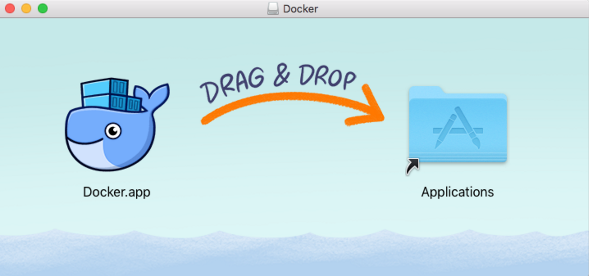

<!-- Start -->
## Today's lecture

* Containers
    * History
    * From a software architecture perspective
* Docker
  * What is docker
  * Characteristics
  * Basic concepts
* Practical
  * How to install
  * Dockerfile
  * Docker-compose (intro only)

Note:
These are the topics for todays lecture.


---

## Containers


<!-- {_class="center"} -->

Note:
Black boxex. Dont know whats in them, isolated processes<br>
Dont care whats in them, know how to distribute them and ship them<br>
Mitten av 50-talet<br>
All vet hur man hanterar dem, hor man förvarar dem osv

---
## Containers


<!-- {_class="center"} -->
> "Containers are an important technology that is not going away for a while"

Note:
separated process<br>

--
## History of using containers

* UNIX - "jail" - modified runtime preventing application accessing protected resources
  * jails, an early implementation of container technology, was added to FreeBSD, 2000
* 2004, Solaris containers/zones
* 2006-2008, Linux kernel got support for generic process containers, which were later renamed control groups, or cgroups
* 2008 Linux namespaces, processes with own users and root account
* [The Linux Containers project](https://linuxcontainers.org/), created by engineers from IBM around 2008
  * Projects like LXC and LXD provided an improved user experience around containers
  * Most complete implementation of Linux container manager.
  * Combine namespace and cgroups


--
## History
* [Docker](https://docker.com) tools to help developers pack their application/code
* 2016, CoreOS launches [Rocket 1.0](https://coreos.com/rkt/)
* Orchestrating containers at scale
  * [Kubernetes](https://kubernetes.io/) launched in 2014, Google 
    * Open-source container cluster manager,
  * [Docker swarm](https://docs.docker.com/engine/swarm/)


--
## EVOLVING

Development process | Application Architecture | Deployment & Packaging | Infrastructure
--- | --- | --- | ---
Waterfall | Monolithic | Physical | Datacenter
Agile | N-tier | Virtual machines | Hosted datacenter
DevOps | Microservices | Containers | Cloud

https://coursepress.lnu.se/kurs/systemadministrationii/part-2-application-operations/study-material/


---
## Docker


<!-- {_class="center"} -->


--
## What is docker?
* Docker provides a platform and tooling to manage containers
* Started in France as an internal project within dotCloud (now Docker inc.), a platform-as-a-service company
* Focus on minimize the gap from development to deployment
  * Developing, shipping and running
  * Minimize the diversion between development- and production environment
    * "It works on my machine"
* The Docker platform is "Open Source", Promoted by the Docker, Inc
  * https://www.docker.com/community/open-source


--
## Docker overview


<!-- {_class="center"} -->


--
## Docker demon

* The docker engine
  * Client docker CLI
  * REST API
  * Docker daemon server (dockerd)
* The docker daemon
  * The daemon creates and manage Docker objects (images, containers, networks and volumes)

https://docs.docker.com/engine/docker-overview/#docker-engine


--
## Docker core objects
* Images
  * read-only templates with instructions for creating a container
    * Often an image is based on another image
    * Get it from Docker Hub or your own registry
    * Defined in a *Dockerfile*
* Containers
  * A runnable instance of an image
  * Relatively well isolated from other containers and its host machines
  * ``` docker run -i -t ubuntu /bin/bash ```
    * Using the "ubuntu" image - connects to /bin/bash


--
## Docker Registry

* Stores *docker images* (Docker Hub...)
* Public or Private
* Docker store - Buy and sell application or services

https://hub.docker.com/explore/
  

<!-- {_style="width:50%"} -->

Source: https://blog.octo.com/en/docker-registry-first-steps/

<!-- {_style="text-align: right; font-size:60%"} -->

--
## Docker characteristics

* Layers - Changes are done in layers, not the whole image
  * Uses a union filesystem (overlay, auFS)
  * A change to an original image is put in a new layer, not recreate the whole image
* Single process - Best practice
  * Application-centric
  * Application server, load balancer, reversed proxy, database server...
* Stateless, read-only
* Portable
  * The application is separated from low level configurations.
  * Easy to move and run on other Docker engines  
    * Think of containers on a ship...

--
## Volumes
* How to handle dynamic data in a read-only container?
* Docker is using Volumes - Containers for storing persistent data
* Using a volume does not increase the size of containers using it
* A volume could be used/mounted by many containers
* By default, not deleted when container is stopped
  * Recreate a server, still need the data


https://docs.docker.com/engine/admin/volumes/volumes/

<!-- {_style="text-align: right; font-size:60%"} -->


---
## Getting started

* Community Edition (CE) and Enterprise Edition (EE)
  * https://docs.docker.com/engine/installation/
    * Docker for mac, Docker for Windows
    * Requires Microsoft Windows 10 Professional or Enterprise 64-bit.
  * Read installations instructions for your linux dist.
    * https://docs.docker.com/engine/installation/linux/docker-ce/ubuntu/


<!-- {_style="width:50%"} -->

Source: [docker.com](https://docker.com)

<!-- {_style="text-align: right; font-size:60%"} -->


--
## Is it working?

```bash
docker run hello-world
```


--
## Basic ubuntu container

```bash
docker run -i -t ubuntu /bin/bash
```

Note: 'cat /etc/*release*


---
## The Dockerfile
* In the Dockerfile (a textfile) you define your image from which you build your container(s)
* Contains all the commands needed for the preferred image
* Load and build with ``` docker build .```


--

```
# Nginx Dockerfile

FROM ubuntu:16.04
LABEL "com.example.vendor"="LNU"
LABEL version="1.0"
LABEL description="This is just a demo"
LABEL maintainer="thajo@lnu.se"

RUN apt-get update \
    && apt-get install -y nginx \
    && apt-get clean \
    && rm -rf /var/lib/apt/lists/* /tmp/* /var/tmp/* 

EXPOSE 80
CMD ["nginx", "-g", "daemon off;"]

```

```
docker build . -t thajo/nginx
docker run -p 8080:80 -d thajo/nginx
```

Note:
Each command in a own layer<br>
#Running the build
docker build . -t thajo/rails
# Starting a container
docker run -p 80:80 -d thajo/rails
#stoping
docker stop id


--
# Dockerfile commands

* FROM
  * Defines the base image to work with
* LABEL
  * Meta data about this image (creator, maintainer and so on)
* RUN
  * Specifies one (or combined) commands to run in the shell
* CMD
  * One per file, defaults for an executing container (entrypoint is default /bin/sh)
* COPY
  * Copy files or directory and add them to the containers file system
* ADD
  * Like copy, could use URLs, could unpack some compressed files


--
# Dockerfile commands
* ENV
  * Sets an environment variable in the container
* WORKDIR
  * Specifies the working directory from where RUN, CMD, COPY, ADD...runs
* EXPOSE
  * Exposes the ports to the container
* VOLUME
  * Instructs how to create a mount point for holding data


https://docs.docker.com/engine/reference/builder/


--
```bash
## Example
FROM node:8.5.0
LABEL maintainer="thajo@lnu.se"
# Expose a port from the container
EXPOSE 8080
# Set an env-variable
ENV INSTALL_PATH /var/www/app
RUN mkdir -p  $INSTALL_PATH
WORKDIR  $INSTALL_PATH
# Copy code
COPY package.json .
RUN npm install --quiet
# Copy app
COPY . .
CMD ["npm", "start"]
```


--
## Commands to test

```bash
# Running the build with a tag
docker build . -t thajo/rails
# Starting a container
docker run -p 8080:8080 -d thajo/rails
# Starting a container with a bash
docker run -t -i  thajo/rails /bin/bash
# Login to a running container
docker exec -i -t <ps_id> /bin/bash
# Stop all containers
docker stop $(docker ps -a -q)
# Remove all containers
docker rm $(docker ps -a -q)
# Remove all images
docker rmi $(docker images -q)
# Remove all valumes (make sure to remove the volume container first)
docker volume rm $(docker volume ls -qf dangling=true)

```
```bash
## Creates a volume with the name "logs"
docker volume create logs
## start a container and mounts the volume
docker run -t -i -v logs:/app-logs ubuntu /bin/bash
## share the same volume
docker run -t -i --volumes-from logscontainer centos /bin/bash
# create both volume and container
docker run -v ~/myApp/src:/app -it ubuntu /bin/bash
```

---
#Docker Compose

> Compose is a tool for defining and running multi-container Docker applications

* Uses a YAML-file to configure an applications services
* Structure is shown through indentation (one or more spaces - NOT tabs).
* List items are denoted by a dash
* Key value pairs within a map are separated by a colon.

http://www.yaml.org/


--
```
version: '3'
services:
  web:
    build: .
    depends_on:
      - mongodb
    ports:
      - "8080:5000"
  mongodb:
    image: mongo:3.4
    expose:
      - "27017"
    volumes:
      - mongodbdata:/data/db
volumes:
  mongodbdata:
```
--
version: "3"
services:
   db:
     image: mysql:5.7
     volumes:
       - db_data:/var/lib/mysql
     restart: always
     environment:
       MYSQL_ROOT_PASSWORD: compose78!#jd
       MYSQL_DATABASE: wordpress
       MYSQL_USER: wordpress
       MYSQL_PASSWORD: compose876Rtgy7!%
   wordpress:
     depends_on:
       - db
     image: wordpress:latest
     ports:
       - "8000:80"
     restart: always
     env_file:
      - secrets.env
volumes:
    db_data:
--
## Get started

https://docs.docker.com/get-started/


---
# Tack för idag


<!-- {_class="center"} -->
