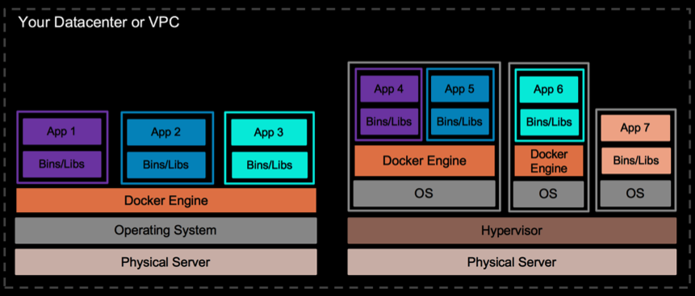

<!-- Start -->
## Today's lecture

* Containers
    * History
    * Containers core concepts
    * From a software perspective
* Docker
  * History
  * Characteristics
  * Basic concepts
* Practical
  * How to install
  * Dockerfile
  * Docker-compose

Note:
These are the topics for todays lecture.

---

## Containers

> Containers are an important technology that is not going away for a while

Note:
separated process 

--

--

## History

* UNIX - "jail" - modified runtime preventing application accessing protected resources
  * And jails, an early implementation of container technology, was added to FreeBSD., 2000
* Linux-VServer project lacked process migration and clustering, its real weakness was that it required a patched kernel
* 2004, Solaris zones
* 2006, Linuxkernel, The result was generic process containers, which were later renamed control groups, or cgroups
* 2008 user namespaces, processes with own users and root account
* The Linux Containers project (LXC), created by engineers from IBM around 2008,
  * LXC provided an improved user experience around containers
  * Since the 1.0 release of LXC in early 2014
  * most complete implementation of Linux container manager.
* LXC userspace tools with even easier to use tooling aimed at developers looking for simple ways to package their applications.
  * Docker, 2015, donated the project’s existing codebase to the Open Container Initiative
* Orchestrating at Scale
  * Kubernetes launched in 2014, Google discussed how “everything at Google runs in a container”
* 2016, CoreOS launches Rocket 1.0

--
## Containers core concepts

* Container manager
  * Tools that help you create a container, deploy it and get it Running
    * Docker, Rocket
* Configuration File
  * A file where the containers (or application) needs is defined
* Layers
  * A container is made up of Layers
    1. A base layer - a base OS (Ubuntu)
    2. A web server (Apache)
    3. An application platform runtime (PHP)
    4. The application code
* Images
  * A template of your container defined by the configuration file (and build with layers)
  * Ready to be hosted on one or many hosts
* Registers
  * Stores container images (Docker hub)
  * Gives you reusability
  * Use base images in a layer
* Scaling containers
  * Container loads much more quickly then VMs
  * Load balancing
  * Example; Kubernetes, etcd, Docker swarm

---
## Modern software architecture

* Monolitic apps --> Microservices
* App servers --> PaaS
* Physical machines or VMs --> Conatiners

--
## Going from monolitics..

--
## ..to microservices

---
## Docker

<!-- {_class="center"} -->
